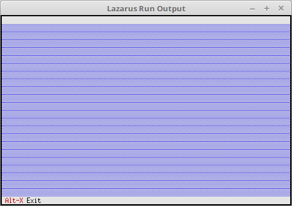

# 01 - Einfuehrung
## 05 - Erster Desktop



Minimalste Free-Vision Anwendung

---
Programm-Name, wie es bei Pascal üblich ist.

```pascal
program Project1;
```

Das überhaupt Free-Vision möglich ist, muss die Unit **App** eingebunden werden.

```pascal
uses
  App;   // TApplication
```

Deklaration für die Free-Vision Anwendung.

```pascal
var
  MyApp: TApplication;
```

Für die Abarbeitung sind immer die drei Schritte notwendig.

```pascal
begin
  MyApp.Init;   // Inizialisieren
  MyApp.Run;    // Abarbeiten
  MyApp.Done;   // Freigeben
end.
```


