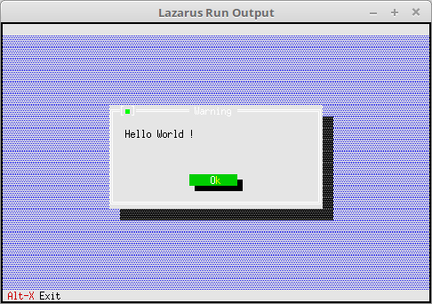

# 01 - Einfuehrung
## 10 - Hello World

<br><br>
Ein Hello World mit Free-Vision.

Der Text wird in einer Message-Box ausgegeben.

<hr><br>

```pascal
program Project1;

uses
  App, MsgBox;
var
  MyApp: TApplication;

begin
  MyApp.Init;
  MessageBox('Hello World !', nil, mfOKButton);
  // MyApp.Run;   // Wen es weiter gehen soll.
  MyApp.Done;
end.
```


