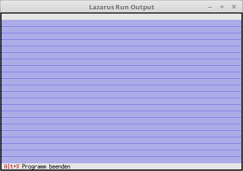

# 02 - Statuszeile und Menu
## 00 - Status Zeile



Ändern der Status-Zeile.
Die Statuszeile wird gebraucht um wichtige Information und HotKey anzuzeigen.

---
Für die Statuszeile werden noch verschiedene Units gebraucht.

```pascal
uses
  App,      // TApplication
  Objects,  // Fensterbereich (TRect)
  Drivers,  // Hotkey
  Views,    // Ereigniss (cmQuit)
  Menus;    // Statuszeile
```

Wen man etwas ändern will, muss man TApplication vererben.
Hier im Beispiel, wird die Statuszeile abgeändert, dazu muss man die Procedure **InitStatusLine** überschreiben.

```pascal
  procedure TMyApp.InitStatusLine;
  var
    R: TRect;           // Rechteck für die Statuszeilen Position.
  begin
    GetExtent(R);       // Liefert die Grösse/Position der App, im Normalfall 0, 0, 80, 24.
    R.A.Y := R.B.Y - 1; // Position der Statuszeile, auf unterste Zeile der App setzen.

    StatusLine := New(PStatusLine, Init(R, NewStatusDef(0, $FFFF, NewStatusKey('~Alt+X~ Programm beenden', kbAltX, cmQuit, nil), nil)));
  end;
```

Das die neue Statuszeile verwendet wird muss man den Nachkomme anstelle von **TApplication** deklarieren.

```pascal
var
  MyApp: TMyApp;
```

Die  bleibt gleich.

```pascal
begin
  MyApp.Init;   // Inizialisieren
  MyApp.Run;    // Abarbeiten
  MyApp.Done;   // Freigeben
end.
```


