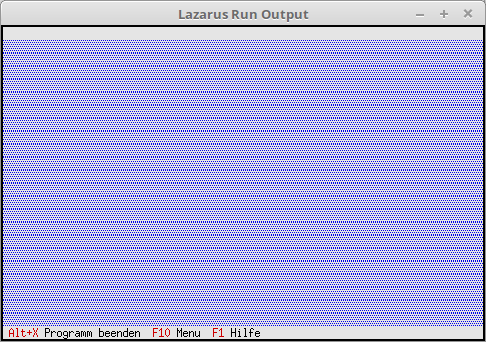

# 02 - Statuszeile und Menu
## 05 - Status Zeile mehrere Eintraege
<br>
<br><br>
<br>
---
<br>

<br>

```pascal
  procedure TMyApp.InitStatusLine;
  var
    R: TRect;                 // Rechteck für die Statuszeilen Position.
<br>
    P0: PStatusDef;           // Pointer ganzer Eintrag.
    P1, P2, P3: PStatusItem;  // Pointer auf die einzelnen Hot-Key.
  begin
    GetExtent(R);             // Liefert die Grösse/Position der App, im Normalfall 0, 0, 80, 24.
    R.A.Y := R.B.Y - 1;       // Position der Statuszeile, auf unterste Zeile der App setzen.
<br>
    P3 := NewStatusKey('~F1~ Hilfe', kbF1, cmHelp, nil);
    P2 := NewStatusKey('~F10~ Menu', kbF10, cmMenu, P3);
    P1 := NewStatusKey('~Alt+X~ Programm beenden', kbAltX, cmQuit, P2);
    P0 := NewStatusDef(0, $FFFF, P1, nil);
<br>
    StatusLine := New(PStatusLine, Init(R, P0));
  end;
```
<br>

<br>
```pascal
var
  MyApp: TMyApp;
<br>
begin
  MyApp.Init;   // Inizialisieren
  MyApp.Run;    // Abarbeiten
  MyApp.Done;   // Freigeben
end.
```
<br>

