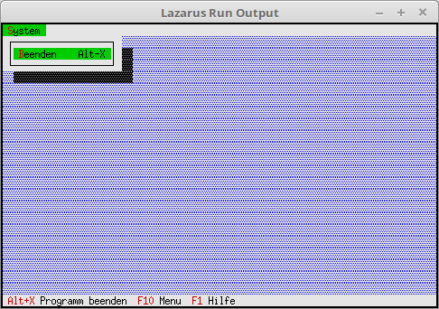

# 02 - Statuszeile und Menu
## 10 - Menu



Hinzufügen eines Menüs.

---
Für das Menü werden die gleichen Units wie für die Statuszeile gebraucht.

```pascal
uses
  App,      // TApplication
  Objects,  // Fensterbereich (TRect)
  Drivers,  // Hotkey
  Views,    // Ereigniss (cmQuit)
  Menus;    // Statuszeile
```

Für ein Menu muss man **InitMenuBar** vererben.

```pascal
type
  TMyApp = object(TApplication)
    procedure InitStatusLine; virtual;   // Statuszeile
    procedure InitMenuBar; virtual;      // Menü
  end;
```

Das Menü erzeugen, das Beispiel hat nur eine einziger Menüpunkt, Beenden.
Beim Menü sind die Zeichen die mit **~x~** hervorgehoben sind nicht nur Optischen, sonder auch funktionell.
Zum beenden, kann man auch **[Alt+s]**, **[b]** drücken.
Es gibt auch direkte HotKey auf die Menüpunkte, hier im Beipiel ist die **[Alt+x]** für beenden.
Dieses überschneidet sich hier zufällig mit **[Alt+x]** von der Statuszeile, aber dies ist egal.
Der Aufbau der Menüerzeugung ist ähnlich der Statuszeile.
Beim letzten Menüpunkt kommt immer ein **nil**.

```pascal
  procedure TMyApp.InitMenuBar;
  var
    R: TRect;           // Rechteck für die Memüzeile Position.
  begin
    GetExtent(R);
    R.B.Y := R.A.Y + 1; // Position des Menüs, auf oberste Zeile der App setzen.

    MenuBar := New(PMenuBar, Init(R, NewMenu(
      NewSubMenu('~D~atei', hcNoContext, NewMenu(
      NewItem('~B~eenden', 'Alt-X', kbAltX, cmQuit, hcNoContext,
      nil)), nil))));
  end;
```


