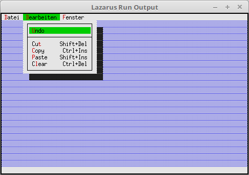

# 02 - Statuszeile und Menu
## 25 - Fertige Statuszeile und Menues
<br><br>
Für die Statuszeile und das Menü gibt es fertige Items, aber ich bevorzuge es, die Items selbst zu erstellen.<br>
Die fetigen Items sind nur in Englisch.<br>
Die Statuszeile ist Textlos, das einzige, sie bringt Schnellkomandos mit. ( cmQuit, cmMenu, cmClose, cmZoom, cmNext, cmPrev )<br>
Bis aus <b>OS shell</b> und <b>Exit</b> passiert nichts.<br>
---
Mit <b>StdStatusKeys(...</b> wird eine Statuszeile estellt, aber wie oben beschrieben, sieht man keinne Text.<br>
```pascal>  procedure TMyApp.InitStatusLine;
  var
    R: TRect;
  begin
    GetExtent(R);
    R.A.Y := R.B.Y - 1;</font>
<br>
    StatusLine := New(PStatusLine, Init(R, NewStatusDef(0, $FFFF, StdStatusKeys(nil), nil)));
  end;```
Fur das Menü gibt es 3 fertige Items, für Datei, Bearbeiten und Fenster, aber eben in Englisch.<br>
```pascal>  procedure TMyApp.InitMenuBar;
  var
    R: TRect;
  begin
    GetExtent(R);
    R.B.Y := R.A.Y + 1;</font>
<br>
    MenuBar := New(PMenuBar, Init(R, NewMenu(
      NewSubMenu('~D~atei', hcNoContext, NewMenu(</font>
        StdFileMenuItems (nil)),
      NewSubMenu('~B~earbeiten', hcNoContext, NewMenu(</font>
         StdEditMenuItems (nil)),
      NewSubMenu('~F~enster', hcNoContext, NewMenu(</font>
        StdWindowMenuItems(nil)), nil))))));
  end;```
<br>
