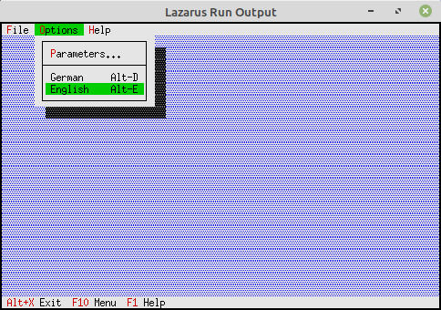

<html>
    <b><h1>02 - Statuszeile und Menu</h1></b>
    <b><h2>35 - Menu und Statuszeile tauschen</h2></b>
  
Man kann zur Laufzeit das komplette Menü und Statuszeile austauschen. 
ZB. um die Anwendung mehrsprachig zu machen. 
Dazu wird die aktuelle Komponente entfernt und die neue eingefügt. 
In dem Beispiel gibt es je eine deutsche und englische Komponente. 

 
Deklaration der Komponenten 
<pre><code>  TMyApp = <b>object</b>(TApplication)
    <b>procedure</b> InitStatusLine; <b>virtual</b>;                 <i>// Statuszeile</i>
    <b>procedure</b> InitMenuBar; <b>virtual</b>;                    <i>// Menü</i>
    <b>procedure</b> HandleEvent(<b>var</b> Event: TEvent); <b>virtual</b>; <i>// Eventhandler</i>
  <b>private</b>
    menuGer, menuEng: PMenuView;          <i>// Die beiden Menüs</i>
    StatusGer, StatusEng: PStatusLine;    <i>// Die beiden Stauszeilen</i>
  <b>end</b>;</code></pre>
Inizialisieren der beiden Statuszeilen. 
<pre><code>  <b>procedure</b> TMyApp.InitStatusLine;
  <b>var</b>
    R: TRect;
  <b>begin</b>
    GetExtent(R);
    R.A.Y := R.B.Y - 1;
 
    <i>// Statuszeile deutsch</i>
    StatusGer := <b>New</b>(PStatusLine, Init(R, NewStatusDef(0, $FFFF,
      NewStatusKey('~Alt+X~ Programm beenden', kbAltX, cmQuit,
      NewStatusKey('~F10~ Menue', kbF10, cmMenu,
      NewStatusKey('~F1~ Hilfe', kbF1, cmHelp, <b>nil</b>))), <b>nil</b>)));
 
    <i>// Statuszeile englisch</i>
    StatusEng := <b>New</b>(PStatusLine, Init(R, NewStatusDef(0, $FFFF,
      NewStatusKey('~Alt+X~ <b>Exit</b>', kbAltX, cmQuit,
      NewStatusKey('~F10~ Menu', kbF10, cmMenu,
      NewStatusKey('~F1~ Help', kbF1, cmHelp, <b>nil</b>))), <b>nil</b>)));
 
    StatusLine := StatusGer; <i>// Deutsch per Default</i>
  <b>end</b>;</code></pre>
Inizialisieren der beiden Menüs. 
<pre><code>  <b>procedure</b> TMyApp.InitMenuBar;
  <b>var</b>
    R: TRect;
  <b>begin</b>
    GetExtent(R);
    R.B.Y := R.A.Y + 1;
 
    <i>// Menü deutsch</i>
    menuGer := <b>New</b>(PMenuBar, Init(R, NewMenu(
      NewSubMenu('~D~atei', hcNoContext, NewMenu(
        NewItem('S~c~hliessen', 'Alt-F3', kbAltF3, cmClose, hcNoContext,
        NewLine(
        NewItem('~B~eenden', 'Alt-X', kbAltX, cmQuit, hcNoContext, <b>nil</b>)))),
      NewSubMenu('~O~ptionen', hcNoContext, NewMenu(
        NewItem('~P~arameter...', '', kbF2, cmPara, hcNoContext,
        NewLine(
        NewItem('~D~eutsch', 'Alt-D', kbAltD, cmMenuGerman, hcNoContext,
        NewItem('~E~nglisch', 'Alt-E', kbAltE, cmMenuEnlish, hcNoContext, <b>nil</b>))))),
      NewSubMenu('~H~ilfe', hcNoContext, NewMenu(
        NewItem('~A~bout...', '', kbNoKey, cmAbout, hcNoContext, <b>nil</b>)), <b>nil</b>))))));
 
    <i>// Menü englisch</i>
    menuEng := <b>New</b>(PMenuBar, Init(R, NewMenu(
      NewSubMenu('~F~ile', hcNoContext, NewMenu(
        NewItem('~C~lose', 'Alt-F3', kbAltF3, cmClose, hcNoContext,
        NewLine(
        NewItem('E~x~it', 'Alt-X', kbAltX, cmQuit, hcNoContext, <b>nil</b>)))),
      NewSubMenu('~O~ptions', hcNoContext, NewMenu(
        NewItem('~P~arameters...', '', kbF2, cmPara, hcNoContext,
        NewLine(
        NewItem('German', 'Alt-D', kbAltD, cmMenuGerman, hcNoContext,
        NewItem('English', 'Alt-E', kbAltE, cmMenuEnlish, hcNoContext, <b>nil</b>))))),
      NewSubMenu('~H~elp', hcNoContext, NewMenu(
        NewItem('~A~bout...', '', kbNoKey, cmAbout, hcNoContext, <b>nil</b>)), <b>nil</b>))))));
 
    MenuBar := menuGer; <i>// Deutsch per Default</i>
  <b>end</b>;</code></pre>
Austauschen der Komponenten 
<pre><code>  <b>procedure</b> TMyApp.HandleEvent(<b>var</b> Event: TEvent);
  <b>var</b>
    Rect: TRect;              <i>// Rechteck für die Statuszeilen Position.</i>
 
  <b>begin</b>
    GetExtent(Rect);
 
    Rect.A.Y := Rect.B.Y - 1;
    <b>inherited</b> HandleEvent(Event);
 
    <b>if</b> Event.What = evCommand <b>then</b> <b>begin</b>
      <b>case</b> Event.Command <b>of</b>
        cmAbout: <b>begin</b>
          <i>// Ein About Dialog</i>
        <b>end</b>;
 
        <i>// Menü auf englisch</i>
        cmMenuEnlish: <b>begin</b>
 
          <i>// Menü tauschen</i>
          Delete(MenuBar);          <i>// Altes Menü entfernen</i>
          MenuBar := menuEng;       <i>// Neues Menü zuordnen</i>
          Insert(MenuBar);          <i>// Neues Menü einfügen</i>
 
          <i>// Statuszeile tauschen</i>
          Delete(StatusLine);       <i>// Alte Statuszeile entfernen</i>
          StatusLine := StatusEng;  <i>// Neue Statuszeile zuordnen</i>
          Insert(StatusLine);       <i>// Neue Statuszeile einfügen</i>
        <b>end</b>;
 
        <i>// Menü auf deutsch</i>
        cmMenuGerman: <b>begin</b>
          Delete(MenuBar);
          MenuBar := menuGer;
          Insert(MenuBar);
 
          Delete(StatusLine);
          StatusLine := StatusGer;
          Insert(StatusLine);
        <b>end</b>;
        cmPara: <b>begin</b>
          <i>// Ein Parameter Dialog</i>
        <b>end</b>;
        <b>else</b> <b>begin</b>
          <b>Exit</b>;
        <b>end</b>;
      <b>end</b>;
    <b>end</b>;
    ClearEvent(Event);
  <b>end</b>;</code></pre>
 
</html>
