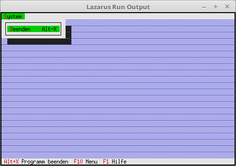

<html>
    <b><h1>02 Statuszeile und Menu</h1></b>
    <b><h2>10 Menu</h2></b>
  
Hinzufügen eines Menüs. 

 
Für das Menü werden die gleichen Units wie für die Statuszeile gebraucht. 
<pre><code><b>uses</b>
  App,      <i>// TApplication</i>
  Objects,  <i>// Fensterbereich (TRect)</i>
  Drivers,  <i>// Hotkey</i>
  Views,    <i>// Ereigniss (cmQuit)</i>
  Menus;    <i>// Statuszeile</i></code></pre>
Für ein Menu muss man <b>InitMenuBar</b> vererben. 
<pre><code><b>type</b>
  TMyApp = <b>object</b>(TApplication)
    <b>procedure</b> InitStatusLine; <b>virtual</b>;   <i>// Statuszeile</i>
    <b>procedure</b> InitMenuBar; <b>virtual</b>;      <i>// Menü</i>
  <b>end</b>;</code></pre>
Das Menü erzeugen, das Beispiel hat nur eine einziger Menüpunkt, Beenden. 
Beim Menü sind die Zeichen die mit <b>~x~</b> hervorgehoben sind nicht nur Optischen, sonder auch funktionell. 
Zum beenden, kann man auch <b>[Alt+s]</b>, <b>[b]</b> drücken. 
Es gibt auch direkte HotKey auf die Menüpunkte, hier im Beipiel ist die <b>[Alt+x]</b> für beenden. 
Dieses überschneidet sich hier zufällig mit <b>[Alt+x]</b> von der Statuszeile, aber dies ist egal. 
Der Aufbau der Menüerzeugung ist ähnlich der Statuszeile. 
Beim letzten Menüpunkt kommt immer ein <b>nil</b>. 
<pre><code>  <b>procedure</b> TMyApp.InitMenuBar;
  <b>var</b>
    R: TRect;           <i>// Rechteck für die Memüzeile Position.</i>
  <b>begin</b>
    GetExtent(R);
    R.B.Y := R.A.Y + 1; <i>// Position des Menüs, auf oberste Zeile der App setzen.</i>
 
    MenuBar := <b>New</b>(PMenuBar, Init(R, NewMenu(
      NewSubMenu('~D~atei', hcNoContext, NewMenu(
      NewItem('~B~eenden', 'Alt-X', kbAltX, cmQuit, hcNoContext,
      <b>nil</b>)), <b>nil</b>))));
  <b>end</b>;</code></pre>
 
</html>
