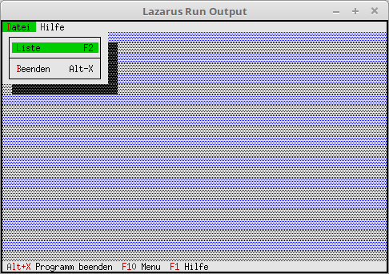

# 03 - Dialoge
## 00 - Event abarbeiten
 
  
Abarbeiten der Events, der Statuszeile und des Menu. 

 
Kommmandos die abgearbeitet werden. 
<pre><code=pascal>const
  cmAbout = 1001;     // About anzeigen
  cmList = 1002;      // Datei Liste</code></pre>
Der EventHandler ist auch ein Nachkommen. 
<pre><code=pascal>type
  TMyApp = object(TApplication)
    procedure InitStatusLine; virtual;                 // Statuszeile
    procedure InitMenuBar; virtual;                    // Menü
    procedure HandleEvent(var Event: TEvent); virtual; // Eventhandler
  end;</code></pre>
Abarbeiten der eigenen cmxxx Kommandos. 
<pre><code=pascal>  procedure TMyApp.HandleEvent(var Event: TEvent);
  begin
    inherited HandleEvent(Event);
 
    if Event.What = evCommand then begin
      case Event.Command of
        cmAbout: begin    // Mache was mit cmAbout.
        end;
        cmList: begin     // Mache was mit cmList.
        end;
        else begin
          Exit;
        end;
      end;
    end;
    ClearEvent(Event);
  end;</code></pre>
 
