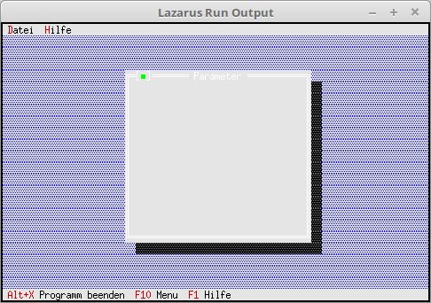

<html>
    <b><h1>03 - Dialoge</h1></b>
    <b><h2>05 - Erster Dialog</h2></b>
  
Abarbeiten der Events, der Statuszeile und des Menu. 

 
Für Dialoge muss man noch die Unit <b>Dialogs</b> einfügen. 
<pre><code><b>uses</b>
  App,      <i>// TApplication</i>
  Objects,  <i>// Fensterbereich (TRect)</i>
  Drivers,  <i>// Hotkey</i>
  Views,    <i>// Ereigniss (cmQuit)</i>
  Menus,    <i>// Statuszeile</i>
  Dialogs;  <i>// Dialoge</i></code></pre>
Ein weiteres Kommando für den Aufruf des Dialoges. 
<pre><code><b>const</b>
  cmAbout = 1001;     <i>// About anzeigen</i>
  cmList = 1002;      <i>// Datei Liste</i>
  cmPara = 1003;      <i>// Parameter</i></code></pre>
Neue Funktionen kommen auch in die Klasse. 
Hier ein Dialog für Paramtereingabe. 
<pre><code><b>type</b>
  TMyApp = <b>object</b>(TApplication)
    <b>procedure</b> InitStatusLine; <b>virtual</b>;                 <i>// Statuszeile</i>
    <b>procedure</b> InitMenuBar; <b>virtual</b>;                    <i>// Menü</i>
    <b>procedure</b> HandleEvent(<b>var</b> Event: TEvent); <b>virtual</b>; <i>// Eventhandler</i>
 
    <b>procedure</b> MyParameter;                             <i>// neue Funktion für einen Dialog.</i>
  <b>end</b>;</code></pre>
Das Menü wird um Parameter und Schliessen erweitert. 
<pre><code>  <b>procedure</b> TMyApp.InitMenuBar;
  <b>var</b>
    R: TRect;                          <i>// Rechteck für die Menüzeilen-Position.</i>
 
    M: PMenu;                          <i>// Ganzes Menü</i>
    SM0, SM1,                          <i>// Submenu</i>
    M0_0, M0_1, M0_2, M0_3, M0_4, M0_5,
    M1_0: PMenuItem;                   <i>// Einfache Menüpunkte</i>
 
  <b>begin</b>
    GetExtent(R);
    R.B.Y := R.A.Y + 1;
 
    M1_0 := NewItem('~A~bout...', '', kbNoKey, cmAbout, hcNoContext, <b>nil</b>);
    SM1 := NewSubMenu('~H~ilfe', hcNoContext, NewMenu(M1_0), <b>nil</b>);
 
    M0_5 := NewItem('~B~eenden', 'Alt-X', kbAltX, cmQuit, hcNoContext, <b>nil</b>);
    M0_4 := NewLine(M0_5);
    M0_3 := NewItem('S~c~hliessen', 'Alt-F3', kbAltF3, cmClose, hcNoContext, M0_4);
    M0_2 := NewLine(M0_3);
    M0_1 := NewItem('~P~arameter...', '', kbF2, cmPara, hcNoContext, M0_2);
    M0_0 := NewItem('~L~iste', 'F2', kbF2, cmList, hcNoContext, M0_1);
    SM0 := NewSubMenu('~D~atei', hcNoContext, NewMenu(M0_0), SM1);
 
    M := NewMenu(SM0);
 
    MenuBar := <b>New</b>(PMenuBar, Init(R, M));
  <b>end</b>;</code></pre>
Hier wird mit dem Kommando <b>cmPara</b> ein Dialog geöffnet. 
<pre><code>  <b>procedure</b> TMyApp.HandleEvent(<b>var</b> Event: TEvent);
  <b>begin</b>
    <b>inherited</b> HandleEvent(Event);
 
    <b>if</b> Event.What = evCommand <b>then</b> <b>begin</b>
      <b>case</b> Event.Command <b>of</b>
        cmAbout: <b>begin</b>
        <b>end</b>;
        cmList: <b>begin</b>
        <b>end</b>;
        cmPara: <b>begin</b>     <i>// Parameter Dialog öffnen.</i>
          MyParameter;
        <b>end</b>;
        <b>else</b> <b>begin</b>
          <b>Exit</b>;
        <b>end</b>;
      <b>end</b>;
    <b>end</b>;
    ClearEvent(Event);
  <b>end</b>;</code></pre>
Bauen eines leeren Dialoges. 
Auch da wird <b>TRect</b> gebraucht für die Grösse. 
Dies wird bei allen Komponenten gebraucht, egal ob Button, etc. 
<pre><code>  <b>procedure</b> TMyApp.MyParameter;
  <b>var</b>
    Dlg: PDialog;
    R: TRect;
  <b>begin</b>
    R.Assign(0, 0, 35, 15);                    <i>// Grösse des Dialogs.</i>
    R.Move(23, 3);                             <i>// Position des Dialogs.</i>
    Dlg := <b>New</b>(PDialog, Init(R, 'Parameter')); <i>// Dialog erzeugen.</i>
    Desktop^.Insert(Dlg);                      <i>// Dialog der App zuweisen.</i>
  <b>end</b>;</code></pre>
 
</html>
