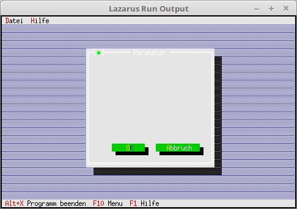

# 03 - Dialoge
## 10 - Button



Dialog um Buttons ergänzen.

---
Den Dialog mit Buttons ergänzen.
Mit **Insert** fügt man die Komponenten hinzug, in diesem Fall sind es die Buttons.
Mit bfDefault legt man den Default-Button fest, dieser wird mit **[Enter]** aktiviert.
bfNormal ist ein gewöhnlicher Button.
Der Dialog wird nun Modal geöffnet, somit können **keine** weiteren Dialoge geöffnet werden.
dummy hat den Wert, des Button der gedrückt wurde, dies entspricht dem **cmxxx** Wert.
Die Höhe der Buttons muss immer **2** sein, ansonsten gibt es eine fehlerhafte Darstellung.

```pascal
  procedure TMyApp.MyParameter;
  var
    Dlg: PDialog;
    R: TRect;
    dummy: word;
  begin
    R.Assign(0, 0, 35, 15);                    // Grösse des Dialogs.
    R.Move(23, 3);                             // Position des Dialogs.
    Dlg := New(PDialog, Init(R, 'Parameter')); // Dialog erzeugen.
    with Dlg^ do begin

      // Ok-Button
      R.Assign(7, 12, 17, 14);
      Insert(new(PButton, Init(R, '~O~K', cmOK, bfDefault)));

      // Schliessen-Button
      R.Move(12, 0);
      Insert(new(PButton, Init(R, '~A~bbruch', cmCancel, bfNormal)));
    end;
    dummy := Desktop^.ExecView(Dlg);   // Dialog Modal öffnen.
    Dispose(Dlg, Done);                // Dialog und Speicher frei geben.
  end;
```


