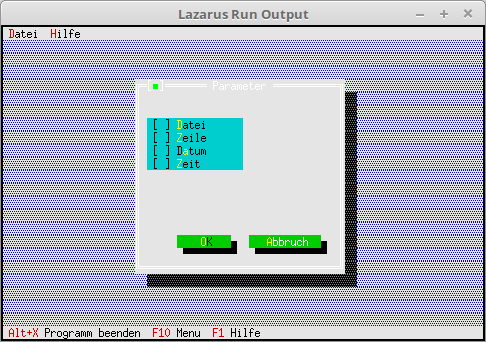

# 03 - Dialoge
## 15 - CheckBoxen
<br><br>
Dialog um CheckBoxen ergänzen.<br>
---
Den Dialog mit CheckBoxen ergänzen.<br>
```pascal>  procedure TMyApp.MyParameter;
  var
    Dlg: PDialog;
    R: TRect;
    dummy: word;
    View: PView;
  begin
    R.Assign(0, 0, 35, 15);</font>
    R.Move(23, 3);</font>
    Dlg := New(PDialog, Init(R, 'Parameter'));</font>
    with Dlg^ do begin
<br>
      // CheckBoxen
      R.Assign(4, 3, 18, 7);</font>
      View := New(PCheckBoxes, Init(R,
        NewSItem('~D~atei',</font>
        NewSItem('~Z~eile',</font>
        NewSItem('D~a~tum',</font>
        NewSItem('~Z~eit',</font>
        nil))))));
      Insert(View);
<br>
      // Ok-Button
      R.Assign(7, 12, 17, 14);</font>
      Insert(new(PButton, Init(R, '~O~K', cmOK, bfDefault)));</font>
<br>
      // Schliessen-Button
      R.Assign(19, 12, 32, 14);</font>
      Insert(new(PButton, Init(R, '~A~bbruch', cmCancel, bfNormal)));</font>
    end;
    dummy := Desktop^.ExecView(Dlg);   // Dialog Modal öffnen.
    Dispose(Dlg, Done);                // Dialog und Speicher frei geben.
  end;```
<br>
