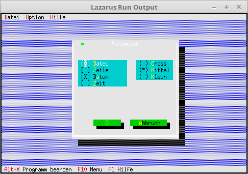

# 03 - Dialoge
## 20 - RadioButton
 
  
Dialog um RadioButtons ergänzen. 
---
Das Menü wurde noch ein wenig geändert/ergänzt. 
<pre><code=pascal>  <b>procedure</b> TMyApp.InitMenuBar;
  <b>var</b>
    R: TRect;                          <i>// Rechteck für die Menüzeilen-Position.</i>
 
    M: PMenu;                          <i>// Ganzes Menü</i>
    SM0, SM1, SM2,                     <i>// Submenu</i>
    M0_0, M0_2, M0_3, M0_4, M0_5,
    M1_0, M2_0: PMenuItem;             <i>// Einfache Menüpunkte</i>
 
  <b>begin</b>
    GetExtent(R);
    R.B.Y := R.A.Y + 1;
 
    M2_0 := NewItem('~A~bout...', '', kbNoKey, cmAbout, hcNoContext, <b>nil</b>);
    SM2 := NewSubMenu('~H~ilfe', hcNoContext, NewMenu(M2_0), <b>nil</b>);
 
    M1_0 := NewItem('~P~arameter...', '', kbF2, cmPara, hcNoContext, <b>nil</b>);
    SM1 := NewSubMenu('~O~ption', hcNoContext, NewMenu(M1_0), SM2);
 
    M0_5 := NewItem('~B~eenden', 'Alt-X', kbAltX, cmQuit, hcNoContext, <b>nil</b>);
    M0_4 := NewLine(M0_5);
    M0_3 := NewItem('S~c~hliessen', 'Alt-F3', kbAltF3, cmClose, hcNoContext, M0_4);
    M0_2 := NewLine(M0_3);
    M0_0 := NewItem('~L~iste', 'F2', kbF2, cmList, hcNoContext, M0_2);
    SM0 := NewSubMenu('~D~atei', hcNoContext, NewMenu(M0_0), SM1);
 
    M := NewMenu(SM0);
 
    MenuBar := <b>New</b>(PMenuBar, Init(R, M));
  <b>end</b>;</code></pre>
Den Dialog mit RadioButton ergänzen, dies funktioniert fast gleich wie bei den CheckBoxen. 
<pre><code=pascal>  <b>procedure</b> TMyApp.MyParameter;
  <b>var</b>
    Dlg: PDialog;
    R: TRect;
    dummy: word;
    View: PView;
  <b>begin</b>
    R.Assign(0, 0, 35, 15);
    R.Move(23, 3);
    Dlg := <b>New</b>(PDialog, Init(R, 'Parameter'));
    <b>with</b> Dlg^ <b>do</b> <b>begin</b>
 
      <i>// CheckBoxen</i>
      R.Assign(2, 3, 18, 7);
      View := <b>New</b>(PCheckBoxes, Init(R,
        NewSItem('~D~atei',
        NewSItem('~Z~eile',
        NewSItem('D~a~tum',
        NewSItem('~Z~eit',
        <b>nil</b>))))));
      Insert(View);
 
      <i>// RadioButton</i>
      R.Assign(21, 3, 33, 6);
      View := <b>New</b>(PRadioButtons, Init(R,
        NewSItem('~G~ross',
        NewSItem('~M~ittel',
        NewSItem('~K~lein',
        <b>nil</b>)))));
      Insert(View);
 
      <i>// Ok-Button</i>
      R.Assign(7, 12, 17, 14);
      Insert(<b>new</b>(PButton, Init(R, '~O~K', cmOK, bfDefault)));
 
      <i>// Schliessen-Button</i>
      R.Assign(19, 12, 32, 14);
      Insert(<b>new</b>(PButton, Init(R, '~A~bbruch', cmCancel, bfNormal)));
    <b>end</b>;
    dummy := Desktop^.ExecView(Dlg);   <i>// Dialog Modal öffnen.</i>
    <b>Dispose</b>(Dlg, Done);                <i>// Dialog und Speicher frei geben.</i>
  <b>end</b>;</code></pre>
 
