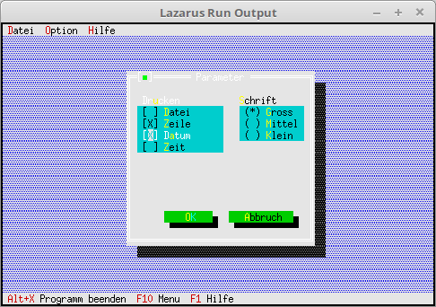

# 03 - Dialoge
## 25 - Bezeichnung fuer Check und Radio-Group



Radio und Check-Group mit einem Label bezeichnen.

---
Die Check und Radio-GroupButton mit Label ergänzen.
Dies funktioniert fast gleich, wie ein normales Label. einziger Unterschied, anstelle von **nil** gibt man den Pointer auf die Group mit.

```pascal
  procedure TMyApp.MyParameter;
  var
    Dlg: PDialog;
    R: TRect;
    dummy: word;
    View: PView;
  begin
    R.Assign(0, 0, 35, 15);
    R.Move(23, 3);
    Dlg := New(PDialog, Init(R, 'Parameter'));
    with Dlg^ do begin

      // CheckBoxen
      R.Assign(2, 3, 18, 7);
      View := New(PCheckBoxes, Init(R,
        NewSItem('~D~atei',
        NewSItem('~Z~eile',
        NewSItem('D~a~tum',
        NewSItem('~Z~eit',
        nil))))));
      Insert(View);
      // Label für CheckGroup.
      R.Assign(2, 2, 10, 3);
      Insert(New(PLabel, Init(R, 'Dr~u~cken', View)));

      // RadioButton
      R.Assign(21, 3, 33, 6);
      View := New(PRadioButtons, Init(R,
        NewSItem('~G~ross',
        NewSItem('~M~ittel',
        NewSItem('~K~lein',
        nil)))));
      Insert(View);
      // Label für RadioGroup.
      R.Assign(20, 2, 31, 3);
      Insert(New(PLabel, Init(R, '~S~chrift', View)));

      // Ok-Button
      R.Assign(7, 12, 17, 14);
      Insert(new(PButton, Init(R, '~O~K', cmOK, bfDefault)));

      // Schliessen-Button
      R.Assign(19, 12, 32, 14);
      Insert(new(PButton, Init(R, '~A~bbruch', cmCancel, bfNormal)));
    end;
    dummy := Desktop^.ExecView(Dlg);   // Dialog Modal öffnen.
    Dispose(Dlg, Done);                // Dialog und Speicher frei geben.
  end;
```


