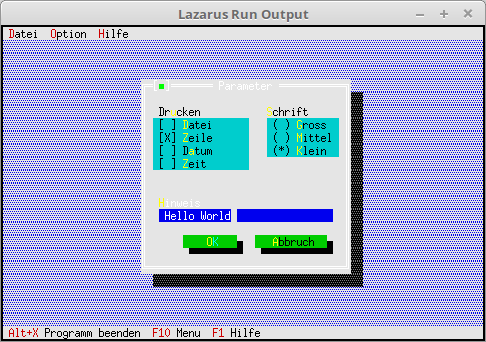

# 03 - Dialoge
## 30 - InputLine (Edit-Zeile)
 
  
Einfügen eine Edit-Zeile. 

 
Die Check und Radio-GroupButton mit Label ergänzen. 
Dies funktioniert fast gleich, wie ein normales Label. einziger Unterschied, anstelle von <b>nil</b> gibt man den Pointer auf die Group mit. 
<pre><code=pascal>  <b>procedure</b> TMyApp.MyParameter;
  <b>var</b>
    Dlg: PDialog;
    R: TRect;
    dummy: word;
    View: PView;
  <b>begin</b>
    R.Assign(0, 0, 35, 15);
    R.Move(23, 3);
    Dlg := <b>New</b>(PDialog, Init(R, 'Parameter'));
    <b>with</b> Dlg^ <b>do</b> <b>begin</b>
 
      <i>// CheckBoxen</i>
      R.Assign(2, 3, 18, 7);
      View := <b>New</b>(PCheckBoxes, Init(R,
        NewSItem('~D~atei',
        NewSItem('~Z~eile',
        NewSItem('D~a~tum',
        NewSItem('~Z~eit',
        <b>nil</b>))))));
      Insert(View);
      <i>// Label für CheckGroup.</i>
      R.Assign(2, 2, 10, 3);
      Insert(<b>New</b>(PLabel, Init(R, 'Dr~u~cken', View)));
 
      <i>// RadioButton</i>
      R.Assign(21, 3, 33, 6);
      View := <b>New</b>(PRadioButtons, Init(R,
        NewSItem('~G~ross',
        NewSItem('~M~ittel',
        NewSItem('~K~lein',
        <b>nil</b>)))));
      Insert(View);
      <i>// Label für RadioGroup.</i>
      R.Assign(20, 2, 31, 3);
      Insert(<b>New</b>(PLabel, Init(R, '~S~chrift', View)));
 
      <i>// Edit Zeile</i>
      R.Assign(3,10,32,11);
      View:=<b>New</b>(PInputLine,Init(R,50));
      Insert(View);
      <i>// Label für Edit Zeile</i>
      R.Assign(2,9,10,10);
      Insert(<b>New</b>(PLabel,Init(R,'~H~inweis',View)));
 
      <i>// Ok-Button</i>
      R.Assign(7, 12, 17, 14);
      Insert(<b>new</b>(PButton, Init(R, '~O~K', cmOK, bfDefault)));
 
      <i>// Schliessen-Button</i>
      R.Assign(19, 12, 32, 14);
      Insert(<b>new</b>(PButton, Init(R, '~A~bbruch', cmCancel, bfNormal)));
    <b>end</b>;
    dummy := Desktop^.ExecView(Dlg);   <i>// Dialog Modal öffnen.</i>
    <b>Dispose</b>(Dlg, Done);                <i>// Dialog und Speicher frei geben.</i>
  <b>end</b>;</code></pre>
 
