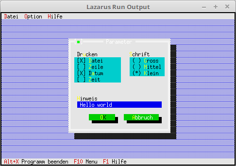

# 03 - Dialoge
## 35 - Werte im Dialog merken
 
  
Bis jetzt gingen die Werte im Dialog immer wieder verloren, wen man diesen schliesste und wieder öffnete. 
Aus diesem Grund werden jetzt die Werte in einen Record gespeichert. 

 
  In diesem Record werden die Werte des Dialoges gespeichert. 
  Die Reihenfolge der Daten im Record <b>muss</b> genau gleich sein, wie bei der Erstellung der Komponenten, ansonten gibt es einen Kräsch. 
  Bei Turbo-Pascal musste ein <b>Word</b> anstelle von <b>LongWord</b> genommen werden, dies ist wichtig beim Portieren alter Anwendungen. 
<pre><code=pascal><b>type</b>
  TParameterData = <b>record</b>
    Druck,
    Schrift: longword;
    Hinweis: <b>string</b>[50];
  <b>end</b>;</code></pre>
Hier wird noch der Constructor vererbt, diesen Nachkomme wird gebraucht um die Dialogdaten mit Standard Werte zu laden. 
<pre><code=pascal><b>type</b>
  TMyApp = <b>object</b>(TApplication)
    ParameterData: TParameterData;                     <i>// Daten für Parameter-Dialog</i>
    <b>constructor</b> Init;                                  <i>// Neuer Constructor</i>
 
    <b>procedure</b> InitStatusLine; <b>virtual</b>;                 <i>// Statuszeile</i>
    <b>procedure</b> InitMenuBar; <b>virtual</b>;                    <i>// Menü</i>
    <b>procedure</b> HandleEvent(<b>var</b> Event: TEvent); <b>virtual</b>; <i>// Eventhandler</i>
 
    <b>procedure</b> MyParameter;                             <i>// neue Funktion für einen Dialog.</i>
  <b>end</b>;</code></pre>
Der Constructoer welcher die Werte für den Dialog ladet. 
Die Datenstruktur für die RadioButtons ist einfach. 0 ist der erste Button, 1 der Zweite, 2 der Dritte, usw. 
Bei den Checkboxen macht man es am besten Binär. Im Beispiel werden der erste und dritte CheckBox gesetzt. 
<pre><code=pascal>  <b>constructor</b> TMyApp.Init;
  <b>begin</b>
    <b>inherited</b> Init;     <i>// Vorfahre aufrufen</i>
    <b>with</b> ParameterData <b>do</b> <b>begin</b>
      Druck := %0101;
      Schrift := 2;
      Hinweis := 'Hello world';
    <b>end</b>;
  <b>end</b>;</code></pre>
Der Dialog wird jetzt mit Werten geladen. 
Dies macht man, sobald man fertig ist mit Komponenten ertstellen. 
<pre><code=pascal>  <b>procedure</b> TMyApp.MyParameter;
  <b>var</b>
    Dlg: PDialog;
    R: TRect;
    dummy: word;
    View: PView;
  <b>begin</b>
    R.Assign(0, 0, 35, 15);
    R.Move(23, 3);
    Dlg := <b>New</b>(PDialog, Init(R, 'Parameter'));
    <b>with</b> Dlg^ <b>do</b> <b>begin</b>
 
      <i>// CheckBoxen</i>
      R.Assign(2, 3, 18, 7);
      View := <b>New</b>(PCheckBoxes, Init(R,
        NewSItem('~D~atei',
        NewSItem('~Z~eile',
        NewSItem('D~a~tum',
        NewSItem('~Z~eit',
        <b>nil</b>))))));
      Insert(View);
      <i>// Label für CheckGroup.</i>
      R.Assign(2, 2, 10, 3);
      Insert(<b>New</b>(PLabel, Init(R, 'Dr~u~cken', View)));
 
      <i>// RadioButton</i>
      R.Assign(21, 3, 33, 6);
      View := <b>New</b>(PRadioButtons, Init(R,
        NewSItem('~G~ross',
        NewSItem('~M~ittel',
        NewSItem('~K~lein',
        <b>nil</b>)))));
      Insert(View);
      <i>// Label für RadioGroup.</i>
      R.Assign(20, 2, 31, 3);
      Insert(<b>New</b>(PLabel, Init(R, '~S~chrift', View)));
 
      <i>// Edit Zeile</i>
      R.Assign(3, 10, 32, 11);
      View := <b>New</b>(PInputLine, Init(R, 50));
      Insert(View);
      <i>// Label für Edit Zeile</i>
      R.Assign(2, 9, 10, 10);
      Insert(<b>New</b>(PLabel, Init(R, '~H~inweis', View)));
 
      <i>// Ok-Button</i>
      R.Assign(7, 12, 17, 14);
      Insert(<b>new</b>(PButton, Init(R, '~O~K', cmOK, bfDefault)));
 
      <i>// Schliessen-Button</i>
      R.Assign(19, 12, 32, 14);
      Insert(<b>new</b>(PButton, Init(R, '~A~bbruch', cmCancel, bfNormal)));
    <b>end</b>;
    Dlg^.SetData(ParameterData);      <i>// Dialog mit den Werten laden.</i>
    dummy := Desktop^.ExecView(Dlg);  <i>// Dialog ausführen.</i>
    <b>if</b> dummy = cmOK <b>then</b> <b>begin</b>        <i>// Wen Dialog mit Ok beenden, dann Daten vom Dialog in Record laden.</i>
      Dlg^.GetData(ParameterData);
    <b>end</b>;
 
    <b>Dispose</b>(Dlg, Done);               <i>// Dialog und Speicher frei geben.</i>
  <b>end</b>;</code></pre>
 
