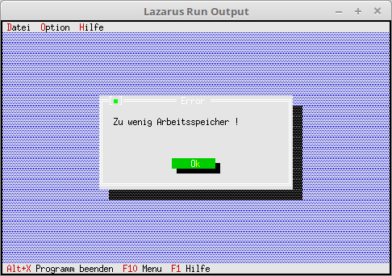

# 03 - Dialoge
## 40 - Freien Speicher ueberpruefen
<br><br>
Überprüfen ob genügend Speicher frei ist, um den Dialog zu erzeugen.<br>
Auf den heutigen Rechner wird die wohl nicht mehr der Fall sein, das der Speicher wegen eines Dialoges überläuft.<br>
---
Die virtuelle Procedure <b>OutOfMemory</b>, wen doch mal der Speicher überläuft.<br>
Wen man diese Methode nicht überschreibt, dann wird keine Fehlermeldung ausgegeben, nur weis dann der Nutzer nicht, wieso sein View nicht erscheint.<br>
```pascal>type
  TMyApp = object(TApplication)
    ParameterData: TParameterData;                     // Parameter für Dialog.
    constructor Init;                                  // Neuer Constructor
<br>
    procedure InitStatusLine; virtual;                 // Statuszeile
    procedure InitMenuBar; virtual;                    // Menü
    procedure HandleEvent(var Event: TEvent); virtual; // Eventhandler
    procedure OutOfMemory; virtual;                    // Wird aufgerufen, wen Speicher überläuft.
<br>
    procedure MyParameter;                             // neue Funktion für einen Dialog.
  end;```
Die Procedure wird aufgerufen, wen zu wenig Speicher vorhanden ist.<br>
```pascal>  procedure TMyApp.OutOfMemory;
  begin
    MessageBox('Zu wenig Arbeitsspeicher !', nil, mfError + mfOkButton);
  end;```
Der Dialog wird jetzt mit Werten geladen.<br>
Dies macht man, sobald man fertig ist mit Komponenten ertstellen.<br>
Mit <b>ValidView(...</b> prüft man ob genügend Specher vorhanden ist, um die Komponente zu erzeugen.<br>
Wen nicht, kommt <b>nil<(b> zurück. Dabei spielt es keine Rolle, ob man <b>OutOfMemory</b> überschreibt.<br>
```pascal>  procedure TMyApp.MyParameter;
  var
    Dlg: PDialog;
    R: TRect;
    dummy: word;
    View: PView;
  begin
    R.Assign(0, 0, 35, 15);</font>
    R.Move(23, 3);</font>
    Dlg := New(PDialog, Init(R, 'Parameter'));</font>
    with Dlg^ do begin
<br>
      // CheckBoxen
      R.Assign(2, 3, 18, 7);</font>
      View := New(PCheckBoxes, Init(R,
        NewSItem('~D~atei',</font>
        NewSItem('~Z~eile',</font>
        NewSItem('D~a~tum',</font>
        NewSItem('~Z~eit',</font>
        nil))))));
      Insert(View);
      // Label für CheckGroup.
      R.Assign(2, 2, 10, 3);</font>
      Insert(New(PLabel, Init(R, 'Dr~u~cken', View)));</font>
<br>
      // RadioButton
      R.Assign(21, 3, 33, 6);</font>
      View := New(PRadioButtons, Init(R,
        NewSItem('~G~ross',</font>
        NewSItem('~M~ittel',</font>
        NewSItem('~K~lein',</font>
        nil)))));
      Insert(View);
      // Label für RadioGroup.
      R.Assign(20, 2, 31, 3);</font>
      Insert(New(PLabel, Init(R, '~S~chrift', View)));</font>
<br>
      // Edit Zeile
      R.Assign(3, 10, 32, 11);</font>
      View := New(PInputLine, Init(R, 50));</font>
      Insert(View);
      // Label für Edit Zeile
      R.Assign(2, 9, 10, 10);</font>
      Insert(New(PLabel, Init(R, '~H~inweis', View)));</font>
<br>
      // Ok-Button
      R.Assign(7, 12, 17, 14);</font>
      Insert(new(PButton, Init(R, '~O~K', cmOK, bfDefault)));</font>
<br>
      // Schliessen-Button
      R.Assign(19, 12, 32, 14);</font>
      Insert(new(PButton, Init(R, '~A~bbruch', cmCancel, bfNormal)));</font>
    end;
    if ValidView(Dlg) <> nil then begin // Prüfen ob genügend Speicher.
      Dlg^.SetData(ParameterData);      // Dialog mit den Werten laden.
      dummy := Desktop^.ExecView(Dlg);  // Dialog ausführen.
      if dummy = cmOK then begin        // Wen Dialog mit Ok beenden, dann Daten vom Dialog in Record laden.
        Dlg^.GetData(ParameterData);
      end;
<br>
      Dispose(Dlg, Done);               // Dialog und Speicher frei geben.
    end;
  end;```
<br>
