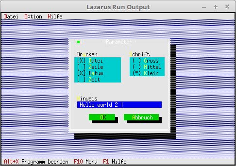

# 03 - Dialoge
## 45 - Werte des Dialoges auf Platte speichern
<br>
<br><br>
Das die Werte des Dialoges auch nach beenden der Anwendung erhalten bleiben, speichern wir die Daten auf die Platte.<br>
Es wird nicht überprüft, ob geschrieben werden kann, etc.<br>
Wen man dies will müsste man mit <b>IOResult</b>, etc. überprüfen.<br>
<hr><br>
Hier kommt noch <b>sysutils</b> hinzu, sie wird für <b>FileExits</b> gebraucht.<br>
```pascal>uses
  SysUtils, // Für Dateioperationen```
Die Datei, in welcher sich die Daten für den Dialog befinden.<br>
```pascal>const
  DialogDatei = 'parameter.cfg';```
Zu Beginn werden die Daten, wen vorhaden von der Platte geladen, ansonten werden sie erzeugt.<br>
```pascal>  constructor TMyApp.Init;
  begin
    inherited Init;
    // Prüfen ob Datei vorhanden.
    if FileExists(DialogDatei) then begin
      // Daten von Platte laden.
      AssignFile(fParameterData, DialogDatei);
      Reset(fParameterData);
      Read(fParameterData, ParameterData);
      CloseFile(fParameterData);
      // ansonsten Default-Werte nehmen.
    end else begin
      with ParameterData do begin
        Druck := %0101;
        Schrift := 2;
        Hinweis := 'Hello world !';
      end;
    end;
  end;```
Die Daten werden auf die Platte gespeichert, wen <b>Ok</b> gedrückt wird.<br>
```pascal>  procedure TMyApp.MyParameter;
  var
    Dlg: PDialog;
    R: TRect;
    dummy: word;
    View: PView;
  begin
    R.Assign(0, 0, 35, 15);
    R.Move(23, 3);
    Dlg := New(PDialog, Init(R, 'Parameter'));
    with Dlg^ do begin
<br>
      // CheckBoxen
      R.Assign(2, 3, 18, 7);
      View := New(PCheckBoxes, Init(R,
        NewSItem('~D~atei',
        NewSItem('~Z~eile',
        NewSItem('D~a~tum',
        NewSItem('~Z~eit',
        nil))))));
      Insert(View);
      // Label für CheckGroup.
      R.Assign(2, 2, 10, 3);
      Insert(New(PLabel, Init(R, 'Dr~u~cken', View)));
<br>
      // RadioButton
      R.Assign(21, 3, 33, 6);
      View := New(PRadioButtons, Init(R,
        NewSItem('~G~ross',
        NewSItem('~M~ittel',
        NewSItem('~K~lein',
        nil)))));
      Insert(View);
      // Label für RadioGroup.
      R.Assign(20, 2, 31, 3);
      Insert(New(PLabel, Init(R, '~S~chrift', View)));
<br>
      // Edit Zeile
      R.Assign(3, 10, 32, 11);
      View := New(PInputLine, Init(R, 50));
      Insert(View);
      // Label für Edit Zeile
      R.Assign(2, 9, 10, 10);
      Insert(New(PLabel, Init(R, '~H~inweis', View)));
<br>
      // Ok-Button
      R.Assign(7, 12, 17, 14);
      Insert(new(PButton, Init(R, '~O~K', cmOK, bfDefault)));
<br>
      // Schliessen-Button
      R.Assign(19, 12, 32, 14);
      Insert(new(PButton, Init(R, '~A~bbruch', cmCancel, bfNormal)));
    end;
    if ValidView(Dlg) <> nil then begin // Prüfen ob genügend Speicher.
      Dlg^.SetData(ParameterData);      // Dialog mit den Werten laden.
      dummy := Desktop^.ExecView(Dlg);  // Dialog ausführen.
      if dummy = cmOK then begin        // Wen Dialog mit Ok beenden, dann Daten vom Dialog in Record laden.
        Dlg^.GetData(ParameterData);
<br>
        // Daten auf Platte speichern.
        AssignFile(fParameterData, DialogDatei);
        Rewrite(fParameterData);
        Write(fParameterData, ParameterData);
        CloseFile(fParameterData);
      end;
<br>
      Dispose(Dlg, Done);               // Dialog und Speicher frei geben.
    end;
  end;```
<br>
