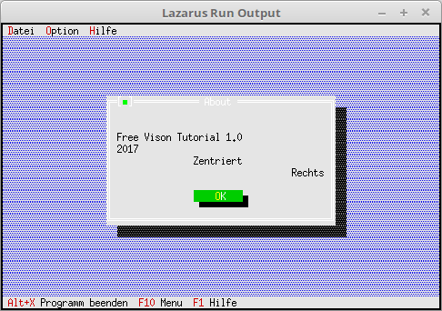

# 03 - Dialoge
## 50 - StaticText gut fuer ein About

<br><br>
Hier wird ein About-Dialog erstellt, das sieht man gut für was man Label gebrauchen kann.
<hr><br>
Die Datei, in welcher sich die Daten für den Dialog befinden.

```pascal
const
  DialogDatei = 'parameter.cfg';
```

Eine neue Funktion <b>About</b> ist hinzugekommen.

```pascal
type
  TMyApp = object(TApplication)
    ParameterData: TParameterData;                     // Parameter für Dialog.
    fParameterData: file of TParameterData;            // File-Hander füe das speichern/laden der Daten des Dialoges.

    constructor Init;                                  // Neuer Constructor

    procedure InitStatusLine; virtual;                 // Statuszeile
    procedure InitMenuBar; virtual;                    // Menü
    procedure HandleEvent(var Event: TEvent); virtual; // Eventhandler
    procedure OutOfMemory; virtual;                    // Wird aufgerufen, wen Speicher überläuft.

    procedure MyParameter;                             // neue Funktion für einen Dialog.
    procedure About;                                   // About Dialog.
  end;
```

Hier wird das About augerufen, wen im Menü About gewält wird.

```pascal
  procedure TMyApp.HandleEvent(var Event: TEvent);
  begin
    inherited HandleEvent(Event);

    if Event.What = evCommand then begin
      case Event.Command of
        cmAbout: begin
          About;   // About Dialog aufrufen
        end;
        cmList: begin
        end;
        cmPara: begin
          MyParameter;
        end;
        else begin
          Exit;
        end;
      end;
    end;
    ClearEvent(Event);
  end;
```

About Dialog erstellen.
Mit <b>TRext.Grow(...</b> kann man das Rect verkleinern und vergrössern.
Mit <b>#13</b> kann man eine Zeilenumbruch einfügen.
Mit <b>#3</b> wird der Text horizontal im Rect zentriert.
Mit <b>#2</b> wird der Text rechtbündig geschrieben.

Mit <b>PLabel</b> könnte man auch Text ausgeben, aber für festen Text eignet sich <b>PStaticText</b> besser.

```pascal
  procedure TMyApp.About;
  var
    Dlg: PDialog;
    R: TRect;
  begin
    R.Assign(0, 0, 42, 11);
    R.Move(1, 1);
    Dlg := New(PDialog, Init(R, 'About'));
    with Dlg^ do begin
      Options := Options or ofCentered; // Dialog zentrieren

      // StaticText einfügen.
      R.Assign(2, 2, 40, 8);
      Insert(New(PStaticText, Init(R,
        #13 +
        'Free Vison Tutorial 1.0' + #13 +
        '2017' + #13 +
        #3 + 'Zentriert' + #13 +
        #2 + 'Rechts')));
      R.Assign(16, 8, 26, 10);
      Insert(New(PButton, Init(R, '~O~K', cmOK, bfDefault)));
    end;
    if ValidView(Dlg) <> nil then begin
      Desktop^.ExecView(Dlg);           // Modal aufrufen, Funktionsergebniss wird nicht ausgewrtet.
      Dispose(Dlg, Done);               // Dialog frei geben.
    end;
  end;
```


