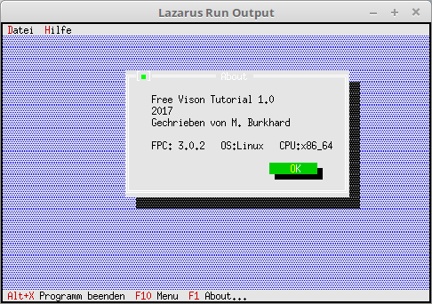

<html>
    <b><h1>04 - Dialoge als Komponente</h1></b>
    <b><h2>00 - Ein einfaches About</h2></b>
  
Wen man immer wieder die gleichen Dialog braucht, packt man diesen am besten als Komponente in eine Unit. 
Dazu schreibt man einen Nachkommen von <b>TDialog</b>. 
Als Beispiel wird hier ein About-Dialog gebaut. 

 
Hier wird der About-Dialog geladen und anschliessend bei Close wieder frei gegeben. 
<pre><code>  <b>procedure</b> TMyApp.HandleEvent(<b>var</b> Event: TEvent);
  <b>var</b>
    AboutDialog: PMyAbout;
  <b>begin</b>
    <b>inherited</b> HandleEvent(Event);
 
    <b>if</b> Event.What = evCommand <b>then</b> <b>begin</b>
      <b>case</b> Event.Command <b>of</b>
        cmAbout: <b>begin</b>
          AboutDialog := <b>New</b>(PMyAbout, Init);         <i>// Neurer Dialog erzeugen.</i>
          <b>if</b> ValidView(AboutDialog) <> <b>nil</b> <b>then</b> <b>begin</b> <i>// Prüfen ob genügend Speicher.</i>
            Desktop^.ExecView(AboutDialog);           <i>// Dialog About ausführen.</i>
            <b>Dispose</b>(AboutDialog, Done);               <i>// Dialog und Speicher frei geben.</i>
          <b>end</b>;
        <b>end</b>;
        <b>else</b> <b>begin</b>
          <b>Exit</b>;
        <b>end</b>;
      <b>end</b>;
    <b>end</b>;
    ClearEvent(Event);
  <b>end</b>;</code></pre>

 
<b>Unit mit dem neuen Dialog.</b> 
<pre><code><b>unit</b> MyDialog;
</code></pre>
Für den Dialog muss ein neuer Konstruktor erzeugt werden. 
Noch ein Hinweis zu StaticText, wen man eine Leerzeile einfügen will, muss man <b>#13#32#13</b> schreiben, bei <b>#13#13</b>, wird nur ein einfacher Zeilenumbruch ausgefühert. 
<pre><code><b>interface</b>
 
<b>uses</b>
  App, Objects, Drivers, Views, Dialogs;
 
<b>type</b>
  PMyAbout = ^TMyAbout;
  TMyAbout = <b>object</b>(TDialog)
    <b>constructor</b> Init;  <i>// Neuer Konstruktor, welche den Dialog mit den Komponenten baut.</i>
  <b>end</b>;
</code></pre>
Im Konstruktor werden die Dialog-Komponeten erzeugt. 
<pre><code><b>implementation</b>
 
<b>constructor</b> TMyAbout.Init;
<b>var</b>
  R: TRect;
<b>begin</b>
  R.Assign(0, 0, 42, 11);
  R.Move(23, 3);
 
  <b>inherited</b> Init(R, 'About');  <i>// Dialog in verdefinierter Grösse erzeugen.</i>
 
  <i>// StaticText</i>
  R.Assign(5, 2, 41, 8);
  Insert(<b>new</b>(PStaticText, Init(R,
    'Free Vison Tutorial 1.0' + #13 +
    '2017' + #13 +
    'Gechrieben von M. Burkhard' + #13#32#13 +
    'FPC: '+ {$I %FPCVERSION%} + '   OS:'+ {$I %FPCTARGETOS%} + '   CPU:' + {$I %FPCTARGETCPU%})));
 
  <i>// Ok-Button</i>
  R.Assign(27, 8, 37, 10);
  Insert(<b>new</b>(PButton, Init(R, '~O~K', cmOK, bfDefault)));
<b>end</b>;
</code></pre>
 
</html>
