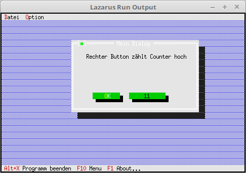

<html>
    <b><h1>04 - Dialoge als Komponente</h1></b>
    <b><h2>10 - Komponenten zur Laufzeit modifizieren</h2></b>
  
In diesem Beispiel wird gezeigt, wie man Komponenten zu Laufzeit ändern kann. 
Dafür wird ein Button verwendet, bei dem sich die Bezeichnung bei jedem Klick erhöht. 

 
<b>Unit mit dem neuen Dialog.</b> 
  
Der Dialog mit dem Zähler-Button. 
<pre><code><b>unit</b> MyDialog;
</code></pre>
Will man eine Komponente zur Laufzeit modifizieren, dann muss man sie deklarieren, ansonsten kann man nicht mehr auf sie zugreifen. 
Direkt mit <b>Insert(New(...</b> geht nicht mehr. 
<pre><code><b>type</b>
  PMyDialog = ^TMyDialog;
  TMyDialog = <b>object</b>(TDialog)
    CounterButton: PButton; <i>// Button mit Zähler.</i>
    <b>constructor</b> Init;
    <b>procedure</b> HandleEvent(<b>var</b> Event: TEvent); <b>virtual</b>;
  <b>end</b>;
</code></pre>
Im Konstruktor sieht man, das man den Umweg über der <b>CounterButton</b> macht. 
<b>CounterButton</b> wird für die Modifikation gebraucht. 
<pre><code><b>const</b>
  cmCounter = 1003;       <i>// Wird lokal für den Zähler-Button gebraucht.</i>
 
<b>constructor</b> TMyDialog.Init;
<b>var</b>
  R: TRect;
<b>begin</b>
  R.Assign(0, 0, 42, 11);
  R.Move(23, 3);
  <b>inherited</b> Init(R, 'Mein Dialog');
 
  <i>// StaticText</i>
  R.Assign(5, 2, 41, 8);
  Insert(<b>new</b>(PStaticText, Init(R, 'Rechter Button z' + #132 + 'hlt Counter hoch')));
 
  <i>// Button, bei den der Titel geändert wird.</i>
  R.Assign(19, 8, 32, 10);
  CounterButton := <b>new</b>(PButton, Init(R, '    ', cmCounter, bfNormal));
  CounterButton^.Title^ := '1';
 
  Insert(CounterButton);
 
  <i>// Ok-Button</i>
  R.Assign(7, 8, 17, 10);
  Insert(<b>new</b>(PButton, Init(R, '~O~K', cmOK, bfDefault)));
<b>end</b>;
</code></pre>
Im EventHandle, wird die Zahl im Button beim Drücken erhöht. 
Das sieht man, warum man den <b>CounterButton</b> braucht, ohne dem hätte man keinen Zugriff auf <b>Titel</b>. 
Wichtig, wen man eine Komponente ändert, muss man mit <b>Draw</b> die Komponente neu zeichnen, ansonsten sieht man den geänderten Wert nicht. 
<pre><code><b>procedure</b> TMyDialog.HandleEvent(<b>var</b> Event: TEvent);
<b>var</b>
  Counter: integer;
<b>begin</b>
  <b>inherited</b> HandleEvent(Event);
 
  <b>case</b> Event.What <b>of</b>
    evCommand: <b>begin</b>
      <b>case</b> Event.Command <b>of</b>
        cmCounter: <b>begin</b>
          Counter := StrToInt(CounterButton^.Title^); <i>// Titel des Button auslesen.</i>
          Inc(Counter);                               <i>// Counter erhöhen.</i>
          <b>if</b> Counter &gt; 9999 <b>then</b> <b>begin</b>                <i>// Auf Überlauf prüfen, weil nur 4 Zeichen zur Verfügung.</i>
            Counter := 9999;
          <b>end</b>;
          CounterButton^.Title^ := IntToStr(Counter); <i>// Neuer Titel an Button übergeben.</i>
 
          CounterButton^.Draw;                        <i>// Button neu zeichnen.</i>
          ClearEvent(Event);                          <i>// Event beenden.</i>
        <b>end</b>;
      <b>end</b>;
    <b>end</b>;
  <b>end</b>;
 
<b>end</b>;
</code></pre>
 
</html>
