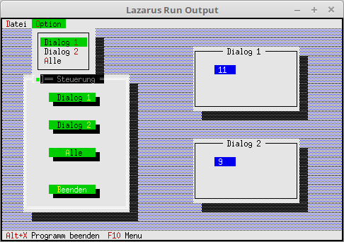

# 04 - Dialoge als Komponente
## 20 - Event an Dialog uebergeben


In diesem Beispiel wird gezeigt, wie man ein Event an eine andere Komponente senden kann.
In diesem Fall wird ein Event an die Dialoge gesendet. In den Dialogen wird dann ein Counter hochgezählt.
Events für den Buttonklick.

```pascal
const
  cmDia1   = 1001;
  cmDia2   = 1002;
  cmDiaAll = 1003;
```

Hier werden die 2 passiven Ausgabe-Dialoge erstellt, dies befinden sich in dem Object TMyDialog.
Auserdem wird ein Dialog erstellt, welcher 3 Button erhält, welche dann die Kommandos an die anderen Dialoge sendet.

```pascal
  constructor TMyApp.Init;
  var
    R: TRect;
    Dia: PDialog;
  begin
    inherited init;

    // erster passsiver Dialog
    R.Assign(45, 2, 70, 9);
    Dialog1 := New(PMyDialog, Init(R, 'Dialog 1'));
    Dialog1^.SetState(sfDisabled, True);    // Dialog auf ReadOnly.
    if ValidView(Dialog1) <> nil then begin // Prüfen ob genügend Speicher.
      Desktop^.Insert(Dialog1);
    end;

    // zweiter passsiver Dialog
    R.Assign(45, 12, 70, 19);
    Dialog2 := New(PMyDialog, Init(R, 'Dialog 2'));
    Dialog2^.SetState(sfDisabled, True);
    if ValidView(Dialog2) <> nil then begin
      Desktop^.Insert(Dialog2);
    end;

    // Steuerdialog
    R.Assign(5, 5, 30, 20);
    Dia := New(PDialog, Init(R, 'Steuerung'));

    with Dia^ do begin
      R.Assign(6, 2, 18, 4);
      Insert(new(PButton, Init(R, 'Dialog ~1~', cmDia1, bfNormal)));

      R.Move(0, 3);
      Insert(new(PButton, Init(R, 'Dialog ~2~', cmDia2, bfNormal)));

      R.Move(0, 3);
      Insert(new(PButton, Init(R, '~A~lle', cmDiaAll, bfNormal)));

      R.Move(0, 4);
      Insert(new(PButton, Init(R, '~B~eenden', cmQuit, bfNormal)));
    end;

    if ValidView(Dia) <> nil then begin
      Desktop^.Insert(Dia);
    end;
  end;
```

Hier werden mit <b>Message</b>, die Kommandos an die Dialoge gesendet.
Gibt man als ersten Parameter die View des Dialoges an, dann wird nur dieser Dialog angesprochen.
Gibt man <b>@Self</b> an, dann werden die Kommandos an alle Dialoge gesendet.
Beim 4. Paramter kann man noch einen Pointer auf einen Bezeichner übergeben,
die kann zB. ein String oder ein Record, etc. sein.

```pascal
  procedure TMyApp.HandleEvent(var Event: TEvent);
  begin
    inherited HandleEvent(Event);

    if Event.What = evCommand then begin
      case Event.Command of
        cmDia1: begin
          Message(Dialog1, evBroadcast, cmCounterUp, nil); // Kommando Dialog 1
        end;
        cmDia2: begin
          Message(Dialog2, evBroadcast, cmCounterUp, nil); // Kommando Dialog 2
        end;
        cmDiaAll: begin
          Message(@Self, evBroadcast, cmCounterUp, nil);   // Kommando an alle Dialoge
        end;
        else begin
          Exit;
        end;
      end;
    end;
    ClearEvent(Event);
  end;
```

---
<b>Unit mit dem neuen Dialog.</b>
<br>
Der Dialog mit der Zähler-Ausgabe.

```pascal
unit MyDialog;

```

Deklaration des Object der passiven Dialoge.

```pascal
type
  PMyDialog = ^TMyDialog;
  TMyDialog = object(TDialog)
  var
    CounterInputLine: PInputLine; // Ausgabe Zeile für den Counter.

    constructor Init(var Bounds: TRect; ATitle: TTitleStr);
    procedure HandleEvent(var Event: TEvent); virtual;
  end;

```

Im Konstructor wird eine Ausgabezeile erzeugt.

```pascal
constructor TMyDialog.Init(var Bounds: TRect; ATitle: TTitleStr);
var
  R: TRect;
begin
  inherited Init(Bounds, ATitle);

  R.Assign(5, 2, 10, 3);
  CounterInputLine := new(PInputLine, Init(R, 20));
  CounterInputLine^.Data^ := '0';
  Insert(CounterInputLine);
end;

```

Im EventHandle wird das Kommando empfangen, welches mit <b>Message</b> gesendet wurde.
Als Beweis dafür, wir die Zahl in der Ausgabezeile un eins erhöht.

```pascal
procedure TMyDialog.HandleEvent(var Event: TEvent);
var
  Counter: integer;
begin
  inherited HandleEvent(Event);

  case Event.What of
    evBroadcast: begin
      case Event.Command of
        cmCounterUp: begin                              // cmCounterUp wurde mit Message gesendet.
          Counter := StrToInt(CounterInputLine^.Data^); // Ausgabezeile auslesen.
          Inc(Counter);                                 // Counter erhöhen.
          CounterInputLine^.Data^ := IntToStr(Counter); // Neue Zahl ausgeben.
          CounterInputLine^.Draw;                       // Asugabezeile aktualisieren.
        end;
      end;
    end;
  end;

end;

```


