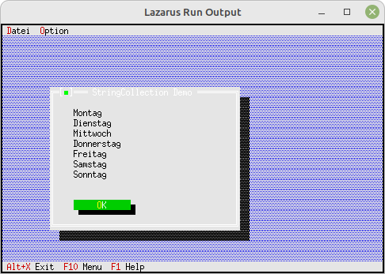

# 06 - Listen und ListBoxen
## 00 - StringCollection unsortiert
 
  
Wen die Stringliste unsortiert bleiben soll, verwendet man <b>PUnSortedStrCollection</b>. 
Nur <b>PCollection</b> reicht <b>nicht</b>, da diese bei <b>Dispose</b> abschmiert. 
---
 
---
 
<b>Unit mit dem neuen Dialog.</b> 
  
Der Dialog mit der UnSortedStrCollection. 
Deklaration des Dialog, nichts Besonderes. 
<pre><code><b>type</b>
  PMyDialog = ^TMyDialog;
  TMyDialog = <b>object</b>(TDialog)
    <b>constructor</b> Init;
  <b>end</b>;
</code></pre>
Es wird eine UnSortedStrCollection gebaut und 
als Demonstration wird deren Inhalt in ein StaticText geschrieben. 
<pre><code><b>constructor</b> TMyDialog.Init;
<b>var</b>
  R: TRect;
  s: shortstring;
  i: Integer;
  StringCollection: PUnSortedStrCollection;
 
<b>const</b>
  Tage: <b>array</b> [0..6] <b>of</b> shortstring = (
    'Montag', 'Dienstag', 'Mittwoch', 'Donnerstag', 'Freitag', 'Samstag', 'Sonntag');
 
<b>begin</b>
  R.Assign(10, 5, 50, 19);
  <b>inherited</b> Init(R, 'StringCollection Demo');
 
  <i>// StringCollection</i>
  StringCollection := <b>new</b>(PUnSortedStrCollection, Init(5, 5));
  <b>for</b> i := 0 <b>to</b> Length(Tage) - 1 <b>do</b> <b>begin</b>
    StringCollection^.Insert(NewStr(Tage[i]));
  <b>end</b>;
  s := '';
 
  <b>for</b> i := 0 <b>to</b> StringCollection^.Count - 1 <b>do</b> <b>begin</b>
    s := s + PString(StringCollection^.At(i))^ + #13;
  <b>end</b>;
 
  <b>Dispose</b>(StringCollection, Done); <i>// Die Liste freigeben</i>
 
  R.Assign(5, 2, 36, 12);
  Insert(<b>new</b>(PStaticText, Init(R, s)));
 
  <i>// Ok-Button</i>
  R.Assign(5, 11, 18, 13);
  Insert(<b>new</b>(PButton, Init(R, '~O~K', cmOK, bfDefault)));
<b>end</b>;
</code></pre>
 
