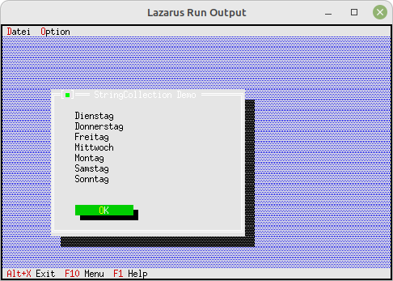

# 06 - Listen und ListBoxen
## 05 - StringCollection sortiert
<br>
<br><br>
Eine sortierte String-Liste<br>
für eine sortierte Liste muss man <b>PStringCollection</b> oder <b>PStrCollection</b> verwenden.<br>
<hr><br>
<hr><br>
<b>Unit mit dem neuen Dialog.</b><br>
<br><br>
Der Dialog mit der <b>StringCollection</b><br>
Deklaration des Dialog, nichts Besonderes.<br>
```pascal
type
  PMyDialog = ^TMyDialog;
  TMyDialog = object(TDialog)
    constructor Init;
  end;
<br>
```
Es wird eine <b>StringCollection</b> gebaut und<br>
als Demonstration wird deren Inhalt in ein StaticText geschrieben.<br>
Man sieht gut, das die Wochentage alphapetisch sortiert sind.<br>
```pascal
constructor TMyDialog.Init;
var
  R: TRect;
  s: shortstring;
  i: Integer;
  StringCollection: PStringCollection;
<br>
const
  Tage: array [0..6] of shortstring = (
  'Montag', 'Dienstag', 'Mittwoch', 'Donnerstag', 'Freitag', 'Samstag', 'Sonntag');
<br>
begin
  R.Assign(10, 5, 50, 19);
  inherited Init(R, 'StringCollection Demo');
<br>
  // StringCollection
  StringCollection := new(PStringCollection, Init(5, 5));
  for i := 0 to Length(Tage) - 1 do begin
    StringCollection^.Insert(NewStr(Tage[i]));
  end;
  s := '';
<br>
  for i := 0 to StringCollection^.Count - 1 do begin
    s := s + PString(StringCollection^.At(i))^ + #13;
  end;
<br>
  Dispose(StringCollection, Done); // Die Liste freigeben
<br>
  R.Assign(5, 2, 36, 12);
  Insert(new(PStaticText, Init(R, s)));
<br>
  // Ok-Button
  R.Assign(5, 11, 18, 13);
  Insert(new(PButton, Init(R, '~O~K', cmOK, bfDefault)));
end;
<br>
```
<br>
