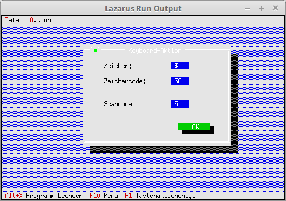

# 08 - EventHandle auserhalb Komponenten
## 05 - Tastatur Event


Man kann einen EventHandle im Dialog/Fenster abfangen, wen man die Maus bewegt/klickt.
Im Hauptprogramm hat es dafür nichts besonders, dies alles läuft lokal im Dialog/Fenster ab.
---
Im Hauptprogramm wird nur der Dialog gebaut, aufgerufe und geschlossen.

```pascal
  procedure TMyApp.HandleEvent(var Event: TEvent);
  var
    KeyDialog: PMyKey;
  begin
    inherited HandleEvent(Event);

    if Event.What = evCommand then begin
      case Event.Command of
        cmKeyAktion: begin
          KeyDialog := New(PMyKey, Init);
          if ValidView(KeyDialog) <> nil then begin // Prüfen ob genügend Speicher.
            Desktop^.ExecView(KeyDialog);           // Dialog Mausaktion ausführen.
            Dispose(KeyDialog, Done);               // Dialog und Speicher frei geben.
          end;
        end;
        else begin
          Exit;
        end;
      end;
    end;
    ClearEvent(Event);
  end;
```

---
<b>Unit mit dem Keyboardaktions-Dialog.</b>
<br>

```pascal
unit MyDialog;

```

In dem Object sind die <b>PEditLine</b> globel deklariert, da diese später bei Mausaktionen modifiziert werden.

```pascal
type
  PMyKey = ^TMyKey;
  TMyKey = object(TDialog)
    EditScanCode, EditShiftState,
    EditZeichen, EditZeichenCode: PInputLine;

    constructor Init;
    procedure HandleEvent(var Event: TEvent); virtual;
  end;

```

Es wird ein Dialog mit EditLine, Label und Button gebaut.
Einzig besonderes dort, die <b>Editlline</b> wird der Status auf <b>ReadOnly</b> gesetzt eigene Eingaben sind dort unerwünscht.

```pascal
constructor TMyKey.Init;
var
  R: TRect;
begin
  R.Assign(0, 0, 42, 15);
  R.Move(23, 3);
  inherited Init(R, 'Keyboard-Aktion');

  // PosX
  R.Assign(25, 2, 30, 3);
  EditZeichen := new(PInputLine, Init(R, 5));
  Insert(EditZeichen);
  EditZeichen^.State := sfDisabled or EditZeichen^.State;    // ReadOnly
  R.Assign(5, 2, 20, 3);
  Insert(New(PLabel, Init(R, 'Zeichen:', EditZeichen)));

  // PosY
  R.Assign(25, 4, 30, 5);
  EditZeichenCode := new(PInputLine, Init(R, 5));
  EditZeichenCode^.State := sfDisabled or EditZeichenCode^.State;    // ReadOnly
  Insert(EditZeichenCode);
  R.Assign(5, 4, 20, 5);
  Insert(New(PLabel, Init(R, 'Zeichencode:', EditZeichenCode)));

  // Maus-Tasten
  R.Assign(25, 7, 30, 8);
  EditScanCode := new(PInputLine, Init(R, 7));
  EditScanCode^.State := sfDisabled or EditScanCode^.State;  // ReadOnly
  Insert(EditScanCode);
  R.Assign(5, 7, 20, 8);
  Insert(New(PLabel, Init(R, 'Scancode:', EditScanCode)));

  // Maus-Tasten
  R.Assign(25, 9, 30, 10);
  EditShiftState := new(PInputLine, Init(R, 7));
  EditShiftState^.State := sfDisabled or EditShiftState^.State;  // ReadOnly
  Insert(EditShiftState);
  R.Assign(5, 9, 20, 10);
  Insert(New(PLabel, Init(R, 'Shiftstate:', EditShiftState)));

  // Ok-Button
  R.Assign(27, 12, 37, 14);
  Insert(new(PButton, Init(R, 'OK', cmOK, bfDefault)));
end;

```

Im EventHandle sieht man, das die Tastatur abgefangen wird. Es wird der Zeichencode und der Scancode ausgegeben.
In der untersten Zeile erscheint ein 3, wen die Shift-Taste mit gewissen anderen Tasten zB. Pfeil-Tasten gedrückt wird.
Die Tastatur-Daten werden an die <b>EditLines</b> ausgegeben.

```pascal
procedure TMyKey.HandleEvent(var Event: TEvent);
begin
  inherited HandleEvent(Event);

  case Event.What of
    evKeyDown: begin                 // Taste wurde gedrückt.
      EditZeichen^.Data^:= Event.CharCode;
      EditZeichen^.Draw;
      EditZeichenCode^.Data^:= IntToStr(Byte(Event.CharCode));
      EditZeichenCode^.Draw;
      EditScanCode^.Data^:= IntToStr(Event.ScanCode);
      EditScanCode^.Draw;
      EditShiftState^.Data^:= IntToStr(Event.KeyShift);
      EditShiftState^.Draw;
    end;
  end;

end;

```


