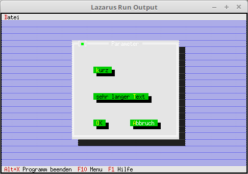

# 10 - Komponenten modifizieren
## 00 - Button modifizieren
<br><br>
Man kann auch eine Komponente modifzieren, in diesem Beispiel ist es ein Button.<br>
Dazu muss man einen Nachkommen von TButton erstellen.<br>
Der abgeänderte Button passt sich automatisch an die Länge des Titels an, auch wird er automatisch 2 Zeilen hoch.<br>
---
Anstelle des normalen Button nehme ich jetzt den PMyButton.<br>
Man sieht auch, das man anstelle von Rect, nur X und Y angibt.<br>
```pascal>  procedure TMyApp.MyParameter;
  var
    Dia: PDialog;
    R: TRect;
  begin
    R.Assign(0, 0, 35, 15);                    // Grösse des Dialogs.
    R.Move(23, 3);                             // Position des Dialogs.
    Dia := New(PDialog, Init(R, 'Parameter')); // Dialog erzeugen.</font>
    with Dia^ do begin
      // oben
      Insert(new(PMyButton, Init(7, 8, 'sehr langer ~T~ext', cmValid, bfDefault)));
<br>
      // mitte
      Insert(new(PMyButton, Init(7, 4, '~k~urz', cmValid, bfDefault)));
<br>
      // Ok-Button
      Insert(new(PMyButton, Init(7, 12, '~O~K', cmOK, bfDefault)));
<br>
      // Schliessen-Button
      Insert(new(PMyButton, Init(19, 12, '~A~bbruch', cmCancel, bfNormal)));
    end;
    Desktop^.ExecView(Dia);   // Dialog Modal öffnen.
    Dispose(Dia, Done);       // Dialog und Speicher frei geben.
  end;```
---
<b>Unit mit dem neuen Button.</b><br>
<br><br>
Hier wird gezeigt, wie man einen Button abänder kann.<br>
<pre><code>unit MyButton;
</code></pre>
Deklaration des neuen Buttons.<br>
Hier sieht man, das man den Konstruktor überschreiben muss.<br>
<pre><code>type
  PMyButton = ^TMyButton;
  TMyButton = object(TButton)
    constructor Init(x, y: integer; ATitle: TTitleStr; ACommand: word; AFlags: word);
  end;
</code></pre>
Im Konstruktor sieht man, das aus <b>X</b> und <b>Y</b> ein <b>Rect</b> generiert wird.<br>
<b>StringReplace</b> werden noch die ~ gelöscht, da diese sonst die Länge des Stringes verfälschen.<br>
<pre><code>constructor TMyButton.Init(x, y: integer; ATitle: TTitleStr; ACommand: word; AFlags: word);
var
  R: TRect;
begin
  R.Assign(x, y, x + Length(StringReplace(ATitle, '~', '', [])) + 2, y + 2);</font>
<br>
  inherited Init(R, ATitle, ACommand, AFlags);
end;
</code></pre>
<br>
