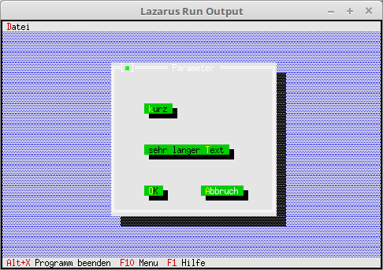

<html>
    <b><h1>06 Komponenten modifizieren</h1></b>
    <b><h2>00 Button modifizieren</h2></b>
  
Man kann auch eine Komponente modifzieren, in diesem Beispiel ist es ein Button. 
Dazu muss man einen Nachkommen von TButton erstellen. 
Der abgeänderte Button passt sich automatisch an die Länge des Titels an, auch wird er automatisch 2 Zeilen hoch. 

 
Anstelle des normalen Button nehme ich jetzt den PMyButton. 
Man sieht auch, das man anstelle von Rect, nur X und Y angibt. 
<pre><code>  <b>procedure</b> TMyApp.MyParameter;
  <b>var</b>
    Dia: PDialog;
    R: TRect;
  <b>begin</b>
    R.Assign(0, 0, 35, 15);                    <i>// Grösse des Dialogs.</i>
    R.Move(23, 3);                             <i>// Position des Dialogs.</i>
    Dia := <b>New</b>(PDialog, Init(R, 'Parameter')); <i>// Dialog erzeugen.</i>
    <b>with</b> Dia^ <b>do</b> <b>begin</b>
      <i>// oben</i>
      Insert(<b>new</b>(PMyButton, Init(7, 8, 'sehr langer ~T~ext', cmValid, bfDefault)));
 
      <i>// mitte</i>
      Insert(<b>new</b>(PMyButton, Init(7, 4, '~k~urz', cmValid, bfDefault)));
 
      <i>// Ok-Button</i>
      Insert(<b>new</b>(PMyButton, Init(7, 12, '~O~K', cmOK, bfDefault)));
 
      <i>// Schliessen-Button</i>
      Insert(<b>new</b>(PMyButton, Init(19, 12, '~A~bbruch', cmCancel, bfNormal)));
    <b>end</b>;
    Desktop^.ExecView(Dia);   <i>// Dialog Modal öffnen.</i>
    <b>Dispose</b>(Dia, Done);       <i>// Dialog und Speicher frei geben.</i>
  <b>end</b>;</code></pre>

 
<b>Unit mit dem neuen Button.</b> 
  
Hier wird gezeigt, wie man einen Button abänder kann. 
<pre><code><b>unit</b> MyButton;
</code></pre>
Deklaration des neuen Buttons. 
Hier sieht man, das man den Konstruktor überschreiben muss. 
<pre><code><b>type</b>
  PMyButton = ^TMyButton;
  TMyButton = <b>object</b>(TButton)
    <b>constructor</b> Init(x, y: integer; ATitle: TTitleStr; ACommand: word; AFlags: word);
  <b>end</b>;
</code></pre>
Im Konstruktor sieht man, das aus <b>X</b> und <b>Y</b> ein <b>Rect</b> generiert wird. 
<b>StringReplace</b> werden noch die ~ gelöscht, da diese sonst die Länge des Stringes verfälschen. 
<pre><code><b>constructor</b> TMyButton.Init(x, y: integer; ATitle: TTitleStr; ACommand: word; AFlags: word);
<b>var</b>
  R: TRect;
<b>begin</b>
  R.Assign(x, y, x + Length(StringReplace(ATitle, '~', '', [])) + 2, y + 2);
 
  <b>inherited</b> Init(R, ATitle, ACommand, AFlags);
<b>end</b>;
</code></pre>
 
</html>
