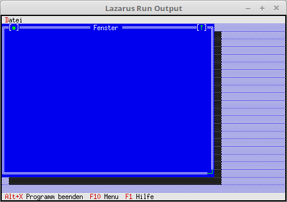

<html>
    <b><h1>11 - Fenster</h1></b>
    <b><h2>00 - Erstes Fenster</h2></b>
  
Erstes Memo-Fenster. 

 
Der Constructor wird vererbt, so das von Anfang an ein neues Fenster erstellt wird. 
<pre><code><b>type</b>
  TMyApp = <b>object</b>(TApplication)
    <b>constructor</b> Init;
 
    <b>procedure</b> InitStatusLine; <b>virtual</b>;
    <b>procedure</b> InitMenuBar; <b>virtual</b>;
 
    <b>procedure</b> NewWindows;
  <b>end</b>;</code></pre>
<pre><code>  <b>constructor</b> TMyApp.Init;
  <b>begin</b>
    <b>inherited</b> Init;   <i>// Der Vorfahre aufrufen.</i>
    NewWindows;       <i>// Fenster erzeugen.</i>
  <b>end</b>;</code></pre>
Neues Fenster erzeugen. Fenster werden in der Regel nicht modal geöffnet, da man meistens mehrere davon öffnen will. 
<pre><code>  <b>procedure</b> TMyApp.NewWindows;
  <b>var</b>
    Win: PWindow;
    R: TRect;
  <b>begin</b>
    R.Assign(0, 0, 60, 20);
    Win := <b>New</b>(PWindow, Init(R, 'Fenster', wnNoNumber));
    <b>if</b> ValidView(Win) <> <b>nil</b> <b>then</b> <b>begin</b>
      Desktop^.Insert(Win);
    <b>end</b>;
  <b>end</b>;</code></pre>
 
</html>
