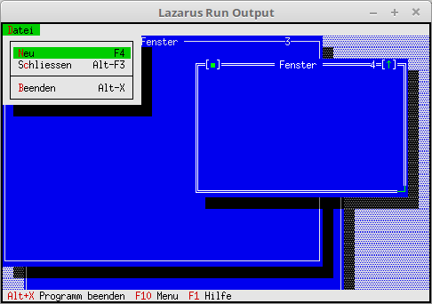

# 11 - Fenster
## 05 - Fenster neu und schliessen

<br><br>
Über das Menü Fenster erzeigen und schliessen.
<hr><br>
Neue Konstanten für Kommados.
Auch ist der HandleEvent dazugekommen.

```pascal
const
  cmNewWin = 1001;
type
  TMyApp = object(TApplication)
    constructor Init;

    procedure InitStatusLine; virtual;
    procedure InitMenuBar; virtual;

    procedure HandleEvent(var Event: TEvent); virtual; // Abarbeitung Kommandos
    procedure OutOfMemory; virtual;                    // Wird aufgerufen, wen Speicher überläuft.

    procedure NewWindows;
  end;
```

Das Menü wurde um <b>Neu</b> und <b>Schliessen</b> ergänzt.

```pascal
  procedure TMyApp.InitMenuBar;
  var
    R: TRect;
  begin
    GetExtent(R);
    R.B.Y := R.A.Y + 1;

    MenuBar := New(PMenuBar, Init(R, NewMenu(
      NewSubMenu('~D~atei', hcNoContext, NewMenu(
      NewItem('~N~eu', 'F4', kbF4, cmNewWin, hcNoContext,
      NewItem('S~c~hliessen', 'Alt-F3', kbAltF3, cmClose, hcNoContext,
      NewLine(
      NewItem('~B~eenden', 'Alt-X', kbAltX, cmQuit, hcNoContext, nil))))), nil))));
  end;
```

Beim Fenster erzeugen, ist noch ein Counter hinzugekommen.
Dieser wird benutzt um die Fenster zu nummerieren.

```pascal
  procedure TMyApp.NewWindows;
  var
    Win: PWindow;
    R: TRect;
  const
    WinCounter: integer = 0;      // Zählt Fenster
  begin
    R.Assign(0, 0, 60, 20);
    Inc(WinCounter);
    Win := New(PWindow, Init(R, 'Fenster', WinCounter));
    // Wen zu wenig Speicher für Fenster, dann Counter wieder -1.
    if ValidView(Win) <> nil then begin
      Desktop^.Insert(Win);
    end else begin
      Dec(WinCounter);
    end;
  end;
```

<b>cmNewWin</b> muss man selbst abarbeiten. <b>cmClose</b> für das Schliessen des Fenster läuft es im Hintergrund automatisch.

```pascal
  procedure TMyApp.HandleEvent(var Event: TEvent);
  begin
    inherited HandleEvent(Event);

    if Event.What = evCommand then begin
      case Event.Command of
        cmNewWin: begin
          NewWindows;    // Fenster erzeugen.
        end;
        else begin
          Exit;
        end;
      end;
    end;
    ClearEvent(Event);
  end;
```


