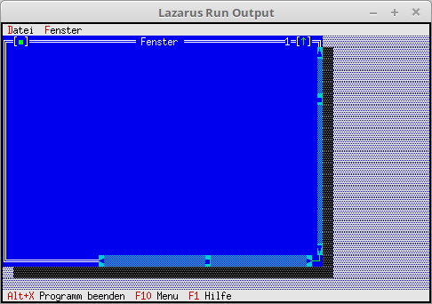

# 11 - Fenster
## 15 - Fenster mit Bedienelemte ausstatten
<br>
<br><br>
Dem Fenster wurden noch Scrollbalken spendiert.<br>
Man könnte noch eine Indikator hinzufügen, welcher Zeilen und Spalten anzeigt.<br>
Und das wichtigste für einen Editor, ein Memo in dem man schreiben kann.<br>
<br>
Wen man einen Editor schreiben will, dann nimmt man dazu <b>PEditWindow</b> aus der Unit <b>Editors</b>.<br>
Dies ist viel einfacher, als alles selbst zu bauen.<br>
<hr><br>
Hier wird das neue vererbte Windows erzeugt.<br>
LineEnding+```pascal
  procedure TMyApp.NewWindows;
  var
    Win: PMyWindow;
    R: TRect;
  const
    WinCounter: integer = 0;      // Zählt Fenster
  begin
    R.Assign(0, 0, 60, 20);
    Inc(WinCounter);
    Win := New(PMyWindow, Init(R, 'Fenster', WinCounter));
<br>
    if ValidView(Win) <> nil then begin
      Desktop^.Insert(Win);
    end else begin
      Dec(WinCounter);
    end;
  end;
```
<br>
<hr><br>
<b>Unit mit dem neuen Fenster.</b><br>
<br><br>
<br>
```pascal
unit MyWindow;
<br>
```
<br>
Ein Horizontaler und ein Vertikaler Scrollbalken einfügen.<br>
Es wird noch gezeigt, wie man die Position des Schiebers festlegen kann.<br>
Mit <b>Min</b> und <b>Max</b> legt man den Bereich fest und mit <b>Value</b> gibt man die Position des Schiebers an.<br>
Ein Indicator wird auch noch eingefügt, welcher die Spalten und Zeilen anzeigt. (Bei einem 64Bit OS ist diese fehlerhaft.)<br>
<br>
```pascal
constructor TMyWindow.Init(var Bounds: TRect; ATitle: TTitleStr; ANumber: Sw_Integer);
var
  VScrollBar, HScrollBar : PScrollBar;  // Rollbalken
  Indicator  : PIndicator;              // Zeilen/Spalten-Anzeige
  R: TRect;
begin
  inherited Init(Bounds, ATitle, ANumber);
  Options := Options or ofTileable;     // Für Tile und Cascade
<br>
  R.Assign (18, Size.Y - 1, Size.X - 2, Size.Y);
  HScrollBar := New (PScrollBar, Init (R));
  HScrollBar^.Max := 100;
  HScrollBar^.Min := 0;
  HScrollBar^.Value := 50;
  Insert (HScrollBar);
<br>
  R.Assign (Size.X - 1, 1, Size.X, Size.Y - 1);
  VScrollBar := New (PScrollBar, Init (R));
  VScrollBar^.Max := 100;
  VScrollBar^.Min := 0;
  VScrollBar^.Value := 20;
  Insert (VScrollBar);
<br>
  R.Assign (2, Size.Y - 1, 16, Size.Y);
  Indicator := New (PIndicator, Init (R));
  Insert (Indicator);
end;
<br>
```
<br>

