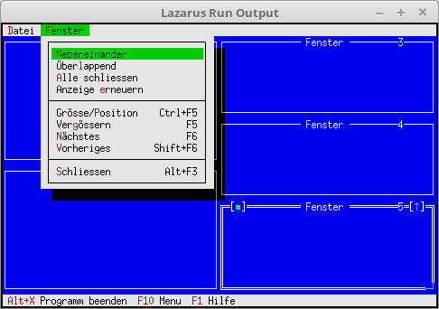

<html>
    <b><h1>07 Fenster</h1></b>
    <b><h2>04 Fenster verwalten</h2></b>
  
Fenster verwalten. Nun ist es möglich über das Menü Steuerkomandos für die Fensterverwaltung zu geben. 
ZB. Zoom, verkleinern, Fensterwechsel, Kaskade, etc. 

 
Das Menü wurde um die Steuerbefehle für die Fensterverwatung ergänzt. 
Die ausgeklammerten Kommandos müssen manuel gemacht werden. 
<pre><code>  <b>procedure</b> TMyApp.InitMenuBar;
  <b>var</b>
    R: TRect;
  <b>begin</b>
    GetExtent(R);
    R.B.Y := R.A.Y + 1;
 
    MenuBar := <b>New</b>(PMenuBar, Init(R, NewMenu(
      NewSubMenu('~D~atei', hcNoContext, NewMenu(
        NewItem('~N~eu', 'F4', kbF4, cmNewWin, hcNoContext,
        NewLine(
        NewItem('~B~eenden', 'Alt-X', kbAltX, cmQuit, hcNoContext, <b>nil</b>)))),
      NewSubMenu('~F~enster', hcNoContext, NewMenu(
        NewItem('~N~ebeneinander', '', kbNoKey, cmTile, hcNoContext,
        NewItem(#154'ber~l~append', '', kbNoKey, cmCascade, hcNoContext,
        NewItem('~A~lle schliessen', '', kbNoKey, cmCloseAll, hcNoContext,
        NewItem('Anzeige ~e~rneuern', '', kbNoKey, cmRefresh, hcNoContext,
        NewLine(
        NewItem('Gr'#148'sse/~P~osition', 'Ctrl+F5', kbCtrlF5, cmResize, hcNoContext,
        NewItem('Ver~g~'#148'ssern', 'F5', kbF5, cmZoom, hcNoContext,
        NewItem('~N~'#132'chstes', 'F6', kbF6, cmNext, hcNoContext,
        NewItem('~V~orheriges', 'Shift+F6', kbShiftF6, cmPrev, hcNoContext,
        NewLine(
        NewItem('~S~chliessen', 'Alt+F3', kbAltF3, cmClose, hcNoContext, <b>Nil</b>)))))))))))), <b>nil</b>)))));
 
  <b>end</b>;</code></pre>
Beim Fenster erzeugen, ist noch ein Counter hinzugekommen. 
Wen man bei den Fenster eine überlappend oder nebeneinader Darstellung will, muss man noch den Status <b>ofTileable</b> setzen. 
<pre><code>  <b>procedure</b> TMyApp.NewWindows;
  <b>var</b>
    Win: PWindow;
    R: TRect;
  <b>const</b>
    WinCounter: integer = 0;                    <i>// Zählt Fenster</i>
  <b>begin</b>
    R.Assign(0, 0, 60, 20);
    Inc(WinCounter);
    Win := <b>New</b>(PWindow, Init(R, 'Fenster', WinCounter));
    Win^.Options := Win^.Options <b>or</b> ofTileable; <i>// Für Tile und Cascade</i>
 
    <b>if</b> ValidView(Win) <> <b>nil</b> <b>then</b> <b>begin</b>
      Desktop^.Insert(Win);
    <b>end</b> <b>else</b> <b>begin</b>
      Dec(WinCounter);
    <b>end</b>;
  <b>end</b>;</code></pre>
Diese Procedure schliesst alle Fenster im Desktop. 
Dazu wird jedem Fenster mit <b>ForEach</b> ein <b>cmClose</b>-Event gesendet. 
<pre><code>  <b>procedure</b> TMyApp.CloseAll;
 
    <b>procedure</b> SendClose(P: PView);
    <b>begin</b>
      Message(P, evCommand, cmClose, <b>nil</b>);
    <b>end</b>;
 
  <b>begin</b>
    Desktop^.ForEach(@SendClose);
  <b>end</b>;</code></pre>
<b>cmNewWin</b> muss man selbst abarbeiten. <b>cmClose</b> für das Schliessen des Fenster läuft im Hintergrund automatisch. 
<pre><code>
  <b>procedure</b> TMyApp.HandleEvent(<b>var</b> Event: TEvent);
  <b>begin</b>
    <b>inherited</b> HandleEvent(Event);
 
    <b>if</b> Event.What = evCommand <b>then</b> <b>begin</b>
      <b>case</b> Event.Command <b>of</b>
        cmNewWin: <b>begin</b>
          NewWindows;    <i>// Fenster erzeugen.</i>
        <b>end</b>;
        cmCloseAll:<b>begin</b>
          CloseAll;      <i>// Schliesst alle Fenster.</i>
        <b>end</b>;
        cmRefresh: <b>begin</b>
          ReDraw;        <i>// Anwendung neu zeichnen.</i>
        <b>end</b>;
        <b>else</b> <b>begin</b>
          <b>Exit</b>;
        <b>end</b>;
      <b>end</b>;
    <b>end</b>;
    ClearEvent(Event);
  <b>end</b>;</code></pre>
 
</html>
