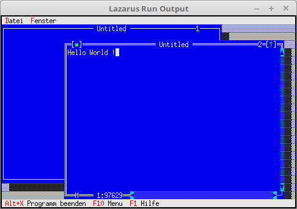

<html>
    <b><h1>12 - Editor</h1></b>
    <b><h2>00 - Einfaches Editor-Fenster</h2></b>
  
Das Fenster ist nun ein Text-Editor, das man diese Funktion erreicht, nimmt man ein <b>PEditWindow</b>. 
Die Verwaltung der Fenster ist gleich, wie bei einem <b>TWindow</b>. 

 
Einfügen eines leeren Editorfensters. 
<pre><code=pascal>  <b>procedure</b> TMyApp.NewWindows;
  <b>var</b>
    Win: PEditWindow;
    R: TRect;
  <b>const</b>
    WinCounter: integer = 0;      <i>// Zählt Fenster</i>
  <b>begin</b>
    R.Assign(0, 0, 60, 20);
    Inc(WinCounter);
    Win := <b>New</b>(PEditWindow, Init(R, '', WinCounter));
 
    <b>if</b> ValidView(Win) <> <b>nil</b> <b>then</b> <b>begin</b>
      Desktop^.Insert(Win);
    <b>end</b> <b>else</b> <b>begin</b>                <i>// Fügt das Fenster ein.</i>
      Dec(WinCounter);
    <b>end</b>;
  <b>end</b>;</code></pre>
 
</html>
