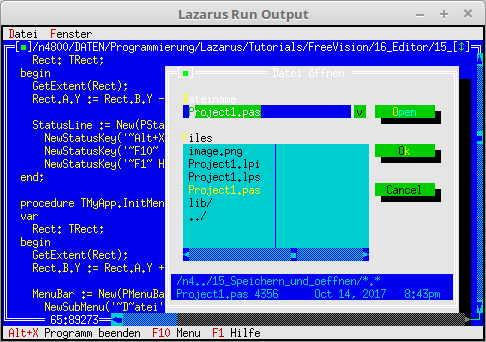

# 12 - Editor
## 05 - Speichern und oeffnen
<br>
<br><br>
<br>

<br>

---
<br>

```pascal
  TMyApp = object(TApplication)
    constructor Init;
<br>
    procedure InitStatusLine; virtual;
    procedure InitMenuBar; virtual;
<br>
    procedure HandleEvent(var Event: TEvent); virtual;
    procedure OutOfMemory; virtual;
<br>
    procedure NewWindows(FileName: ShortString);
    procedure OpenWindows;
    procedure SaveAll;
    procedure CloseAll;
  end;
```
<br>

<br>

<br>

<br>

<br>
```pascal
var
  MyApp: TMyApp;
<br>
  function MyStdEditorDialog(Dialog: Int16; Info: Pointer): Word;
  begin
    case Dialog of
      edSaveAs: begin                 // Neuer Dialog in Deutsch.
        Result := MyApp.ExecuteDialog(New(PFileDialog, Init('*.txt', 'Datei speichern unter', '~D~atei-Name', fdOkButton, 101)), Info);
      end;
    else
      StdEditorDialog(Dialog, Info);  // Original Dialoge aufrufen.
    end;
  end;
<br>
  constructor TMyApp.Init;
  begin
    inherited Init;
    EditorDialog := @MyStdEditorDialog; // Die neue Dialog-Routine.
    DisableCommands([cmSave, cmSaveAs, cmCut, cmCopy, cmPaste, cmClear, cmUndo]);
    NewWindows('');                     // Leeres Fenster erzeugen.
  end;
```
<br>

<br>
```pascal
  procedure TMyApp.InitMenuBar;
  var
    R: TRect;
  begin
    GetExtent(R);
    R.B.Y := R.A.Y + 1;
<br>
    MenuBar := New(PMenuBar, Init(R, NewMenu(
      NewSubMenu('~D~atei', hcNoContext, NewMenu(
        NewItem('~N~eu', 'F4', kbF4, cmNewWin, hcNoContext,
        NewItem('~O~effnen...', 'F3', kbF3, cmOpen, hcNoContext,
        NewItem('~S~peichern', 'F2', kbF2, cmSave, hcNoContext,
        NewItem('Speichern ~u~nter...', '', kbNoKey, cmSaveAs, hcNoContext,
        NewItem('~A~lle speichern', '', kbNoKey, cmSaveAll, hcNoContext,
        NewLine(
        NewItem('~B~eenden', 'Alt-X', kbAltX, cmQuit, hcNoContext, nil)))))))),
      NewSubMenu('~F~enster', hcNoContext, NewMenu(
        NewItem('~N~ebeneinander', '', kbNoKey, cmTile, hcNoContext,
        NewItem(#154'ber~l~append', '', kbNoKey, cmCascade, hcNoContext,
        NewItem('~A~lle schliessen', '', kbNoKey, cmCloseAll, hcNoContext,
        NewItem('Anzeige ~e~rneuern', '', kbNoKey, cmRefresh, hcNoContext,
        NewLine(
        NewItem('Gr'#148'sse/~P~osition', 'Ctrl+F5', kbCtrlF5, cmResize, hcNoContext,
        NewItem('Ver~g~'#148'ssern', 'F5', kbF5, cmZoom, hcNoContext,
        NewItem('~N~'#132'chstes', 'F6', kbF6, cmNext, hcNoContext,
        NewItem('~V~orheriges', 'Shift+F6', kbShiftF6, cmPrev, hcNoContext,
        NewLine(
        NewItem('~S~chliessen', 'Alt+F3', kbAltF3, cmClose, hcNoContext, Nil)))))))))))), nil)))));
<br>
  end;
```
<br>

<br>

```pascal
  procedure TMyApp.NewWindows(FileName: ShortString);
  var
    Win: PEditWindow;
    R: TRect;
  const
    WinCounter: integer = 0;      // Zählt Fenster
  begin
    R.Assign(0, 0, 60, 20);
    Inc(WinCounter);
    Win := New(PEditWindow, Init(R, FileName, WinCounter));
<br>
    if ValidView(Win) <> nil then begin
      Desktop^.Insert(Win);
    end else begin                // Fügt das Fenster ein.
      Dec(WinCounter);
    end;
  end;
```
<br>

<br>

<br>
```pascal
  procedure TMyApp.OpenWindows;
  var
    FileDialog: PFileDialog;
    FileName: ShortString;
  begin
    FileName := '*.*';
    New(FileDialog, Init(FileName, 'Datei '#148'ffnen', '~D~ateiname', fdOpenButton, 1));
    if ExecuteDialog(FileDialog, @FileName) <> cmCancel then begin
      NewWindows(FileName); // Neues Fenster mit der ausgewählten Datei.
    end;
  end;
```
<br>

<br>
```pascal
  procedure TMyApp.SaveAll;
<br>
    procedure SendSave(P: PView);
    begin
      Message(P, evCommand, cmSave, nil); // Das Kommando speicherm mitgeben.
    end;
<br>
  begin
    Desktop^.ForEach(@SendSave);          // Auf alle Fenster anwenden.
  end;
```
<br>

<br>

```pascal
  procedure TMyApp.HandleEvent(var Event: TEvent);
  begin
    inherited HandleEvent(Event);
<br>
    if Event.What = evCommand then begin
      case Event.Command of
        cmNewWin: begin
          NewWindows('');   // Leeres Fenster erzeugen.
        end;
        cmOpen: begin
          OpenWindows;      // Datei öffnen.
        end;
        cmSaveAll: begin
          SaveAll;          // Alle speichern.
        end;
        cmCloseAll:begin
          CloseAll;         // Schliesst alle Fenster.
        end;
        cmRefresh: begin
          ReDraw;           // Anwendung neu zeichnen.
        end;
        else begin
          Exit;
        end;
      end;
    end;
  end;
```
<br>

