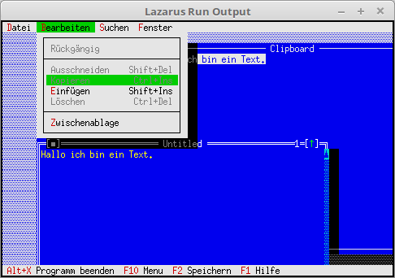

<html>
    <b><h1>12 - Editor</h1></b>
    <b><h2>15 - Zwischenablage</h2></b>
  
Hier wurde ein Zwischenablage hinzugefügt, somit ist auch kopieren und einfügen im Editor möglich. 
Die Zwischeablage ist nicht anderes als ein Editor-Fenster welches die Daten bekommt, wen man kopieren wählt. 
Somit kann man dieses sogar sichbar machen. 

 
Ein Kommando für das öffnen des Zwischenablagefenster. 
<pre><code=pascal><b>const</b>
  cmNewWin = 1001;
  cmRefresh = 1002;
  cmShowClip = 1003;</code></pre>
Hier wird das Fenster für die Zwischenablage deklariert. 
Auch kann man bei <b>NewWindows</b> sagen, ob das Fenster nicht sichtbar ezeigt werden soll. 
<pre><code=pascal><b>type</b>
  TMyApp = <b>object</b>(TApplication)
    ClipWindow: PEditWindow;
 
    <b>constructor</b> Init;
 
    <b>procedure</b> InitStatusLine; <b>virtual</b>;
    <b>procedure</b> InitMenuBar; <b>virtual</b>;
 
    <b>procedure</b> HandleEvent(<b>var</b> Event: TEvent); <b>virtual</b>;
    <b>procedure</b> OutOfMemory; <b>virtual</b>;
 
    <b>function</b> NewWindows(FileName: ShortString; Visible: Boolean = <b>False</b>): PEditWindow;
    <b>procedure</b> OpenWindows;
    <b>procedure</b> SaveAll;
    <b>procedure</b> CloseAll;
  <b>end</b>;</code></pre>
Im Menü sind die neuen Bearbeiten-Funktionen dazugekommen. 
<pre><code=pascal>  <b>procedure</b> TMyApp.InitMenuBar;
  <b>var</b>
    R: TRect;
  <b>begin</b>
    GetExtent(R);
    R.B.Y := R.A.Y + 1;
 
    MenuBar := <b>New</b>(PMenuBar, Init(R, NewMenu(
      NewSubMenu('~D~atei', hcNoContext, NewMenu(
        NewItem('~N~eu', 'F4', kbF4, cmNewWin, hcNoContext,
        NewItem('~O~effnen...', 'F3', kbF3, cmOpen, hcNoContext,
        NewItem('~S~peichern', 'F2', kbF2, cmSave, hcNoContext,
        NewItem('Speichern ~u~nter...', '', kbNoKey, cmSaveAs, hcNoContext,
        NewItem('~A~lle speichern', '', kbNoKey, cmSaveAll, hcNoContext,
        NewLine(
        NewItem('~B~eenden', 'Alt-X', kbAltX, cmQuit, hcNoContext, <b>nil</b>)))))))),
      NewSubMenu('~B~earbeiten', hcNoContext, NewMenu(
        NewItem('~R~'#129'ckg'#132'ngig', '', kbAltBack, cmUndo, hcUndo,
        NewLine(
        NewItem('Aus~s~chneiden', 'Shift+Del', kbShiftDel, cmCut, hcCut,
        NewItem('~K~opieren', 'Ctrl+Ins', kbCtrlIns, cmCopy, hcCopy,
        NewItem('~E~inf'#129'gen', 'Shift+Ins', kbShiftIns, cmPaste, hcPaste,
        NewItem('~L~'#148'schen', 'Ctrl+Del', kbCtrlDel, cmClear, hcClear,
        NewLine(
        NewItem('~Z~wischenablage', '', kbNoKey, cmShowClip, hcCut, <b>nil</b>))))))))),
      NewSubMenu('~S~uchen', hcNoContext, NewMenu(
        NewItem('~S~uchen...', 'Ctrl+F', kbCtrlF, cmFind, hcNoContext,
        NewItem('~E~rsetzten...', 'Ctrl+H', kbCtrlH, cmReplace, hcNoContext,
        NewItem('Suche ~n~'#132'chstes', 'Ctrl+N', kbCtrlN, cmSearchAgain, hcNoContext, <b>nil</b>)))),
      NewSubMenu('~F~enster', hcNoContext, NewMenu(
        NewItem('~N~ebeneinander', '', kbNoKey, cmTile, hcNoContext,
        NewItem(#154'ber~l~append', '', kbNoKey, cmCascade, hcNoContext,
        NewItem('~A~lle schliessen', '', kbNoKey, cmCloseAll, hcNoContext,
        NewItem('Anzeige ~e~rneuern', '', kbNoKey, cmRefresh, hcNoContext,
        NewLine(
        NewItem('Gr'#148'sse/~P~osition', 'Ctrl+F5', kbCtrlF5, cmResize, hcNoContext,
        NewItem('Ver~g~'#148'ssern', 'F5', kbF5, cmZoom, hcNoContext,
        NewItem('~N~'#132'chstes', 'F6', kbF6, cmNext, hcNoContext,
        NewItem('~V~orheriges', 'Shift+F6', kbShiftF6, cmPrev, hcNoContext,
        NewLine(
        NewItem('~S~chliessen', 'Alt+F3', kbAltF3, cmClose, hcNoContext, <b>nil</b>)))))))))))), <b>nil</b>)))))));
  <b>end</b>;</code></pre>
Hier sieht man, wie man ein Fenster unsichbar erzeugen kann. 
<pre><code=pascal>  <b>function</b> TMyApp.NewWindows(FileName: ShortString; Visible: Boolean = <b>False</b>) : PEditWindow;
  <b>var</b>
    Win: PEditWindow;
    R: TRect;
  <b>const</b>
    WinCounter: integer = 0;
  <b>begin</b>
    R.Assign(0, 0, 60, 20);
    Inc(WinCounter);
    Win := <b>New</b>(PEditWindow, Init(R, FileName, WinCounter));
    <b>if</b> ValidView(Win) <> <b>nil</b> <b>then</b> <b>begin</b>
      <b>if</b> Visible <b>then</b> <b>begin</b>
        win^.Hide;        <i>// Fenster verstecken.</i>
      <b>end</b>;
      Result := PEditWindow(MyApp.InsertWindow(win));
    <b>end</b> <b>else</b> <b>begin</b>
      Dec(WinCounter);
    <b>end</b>;
  <b>end</b>;</code></pre>
Hier sieht man, wie man das verborgene Zwischenablagefenster sichbar macht. 
<pre><code=pascal>  <b>procedure</b> TMyApp.HandleEvent(<b>var</b> Event: TEvent);
  <b>begin</b>
    <b>inherited</b> HandleEvent(Event);
 
    <b>if</b> Event.What = evCommand <b>then</b> <b>begin</b>
      <b>case</b> Event.Command <b>of</b>
        cmNewWin: <b>begin</b>
          NewWindows('');
        <b>end</b>;
        cmOpen: <b>begin</b>
          OpenWindows;
        <b>end</b>;
        cmSaveAll: <b>begin</b>
          SaveAll;
        <b>end</b>;
        cmCloseAll: <b>begin</b>
          CloseAll;
        <b>end</b>;
        cmRefresh: <b>begin</b>
          ReDraw;
        <b>end</b>;
        cmShowClip: <b>begin</b>     <i>// Clipboard anzeigen.</i>
          ClipWindow^.Select;
          ClipWindow^.Show;
        <b>end</b>;
        <b>else</b> <b>begin</b>
          <b>Exit</b>;
        <b>end</b>;
      <b>end</b>;
    <b>end</b>;
  <b>end</b>;</code></pre>
 
</html>
