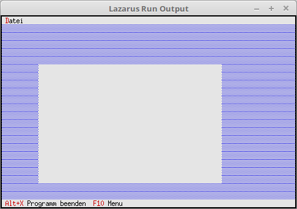

# 14 - TView
## 00 - Einfachstes TView


<b>TView</b>, ist die unterste Ebene von allen Fenster, Dialog, Button, etc.
Au diesem Grund habe ich dieses kleine Beispiel von <b>TView</b> gemacht.
An diesem View sind keinerlei Änderungen möglich, da noch keine Event, Steurerelemente vorhanden sind.
---
Im Konstructor wird das View erzeugt.

```pascal
  constructor TMyApp.Init;
  begin
    inherited Init;   // Der Vorfahre aufrufen.
    NewView;          // View erzeugen.
  end;
```

Es wird ein einfaches View erzeugt, wie erwarte sieht man nicht viel, ausser eines grauen Rechteckes.

```pascal
  procedure TMyApp.NewView;
  var
    Win: PView;
    R: TRect;
  begin
    R.Assign(10, 5, 60, 20);
    Win := New(PView, Init(R));

    if ValidView(Win) <> nil then begin
      Desktop^.Insert(Win);
    end;
  end;
```


