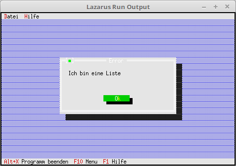

# 15 - Fertige Dialoge
## 00 - Einfache MessageBox



Die einfachsten Dialoge sind die fertigen MessageBoxen.

---
Aufruf einer MessageBox.

```pascal
  procedure TMyApp.HandleEvent(var Event: TEvent);
  begin
    inherited HandleEvent(Event);

    if Event.What = evCommand then begin
      case Event.Command of
        cmAbout: begin
          MessageBox('Ich bin ein About !', nil, mfInformation + mfOkButton);
        end;
        cmWarning: begin
          MessageBox('Ich bin eine Warnung-Box', nil, mfWarning + mfOkButton);
        end;
        cmError: begin
          MessageBox('Ich bin eine Fehlermeldung', nil, mfError + mfOkButton);
        end;
        cmInfo: begin
          MessageBox('Ich bin eine Info-Box', nil, mfInformation + mfOkButton);
        end;
        cmConformation: begin
          MessageBox('Ich bin eine Info-Box', nil, mfConfirmation + mfOkButton);
        end;
        else begin
          Exit;
        end;
      end;
    end;
    ClearEvent(Event);
  end;
```


