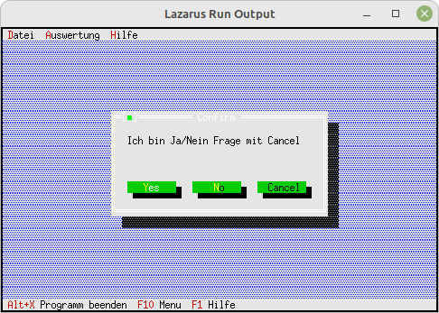

# 15 - Fertige Dialoge
## 05 - Einfache MessageBox mit Auswertung
<br>
<br><br>
Die einfachsten Dialoge sind die fertigen MessageBoxen.<br>
<hr><br>
Konstanten für die verschiedenen Menüeinträge.<br>
```pascal
const
  cmAbout        = 1001;
  cmWarning      = 1002;
  cmError        = 1003;
  cmInfo         = 1004;
  cmConformation = 1005;
  cmYesNo        = 1010;
  cmYesNoCancel  = 1011;```
Aufruf der MessageBoxn.<br>
```pascal
  procedure TMyApp.HandleEvent(var Event: TEvent);
  begin
    inherited HandleEvent(Event);
<br>
    if Event.What = evCommand then begin
      case Event.Command of
        cmAbout: begin
          MessageBox('Ich bin ein About !', nil, mfInformation + mfOkButton);
        end;
        cmWarning: begin
          MessageBox('Ich bin eine Warnung-Box', nil, mfWarning + mfOkButton);
        end;
        cmError: begin
          MessageBox('Ich bin eine Fehlermeldung', nil, mfError + mfOkButton);
        end;
        cmInfo: begin
          MessageBox('Ich bin eine Info-Box', nil, mfInformation + mfOkButton);
        end;
        cmConformation: begin
          MessageBox('Ich bin eine Konfirmation-Box', nil, mfConfirmation + mfOkButton);
        end;
        cmYesNo: begin
          case
            MessageBox('Ich bin Ja/Nein Frage', nil, mfConfirmation + mfYesButton + mfNoButton) of
            cmYes: begin
              MessageBox('Es wurde [JA] geklickt', nil, mfInformation + mfOkButton);
            end;
            cmNo: begin
              MessageBox('Es wurde [NEIN] geklickt', nil, mfInformation + mfOkButton);
            end;
          end;
        end;
        cmYesNoCancel: begin
          case
            MessageBox('Ich bin Ja/Nein Frage mit Cancel', nil, mfConfirmation + mfYesButton + mfNoButton + mfCancelButton) of
            cmYes: begin
              MessageBox('Es wurde [JA] geklickt', nil, mfInformation + mfOkButton);
            end;
            cmNo: begin
              MessageBox('Es wurde [NEIN] geklickt', nil, mfInformation + mfOkButton);
            end;
            cmCancel: begin
              MessageBox('Es wurde [CANCEL] geklickt', nil, mfInformation + mfOkButton);
            end;
          end;
        end;
        else begin
          Exit;
        end;
      end;
    end;
    ClearEvent(Event);
  end;```
<br>
