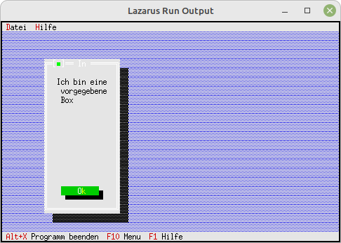

# 15 - Fertige Dialoge
## 10 - Einfache MessageBox mit Vorgabe Rect
 
  
Bei der MessageBox, kann man die Grösse auch manuell festlegen. 
Dazu muss man <b>MeassgeBoxRect(...)</b> verwenden. 
---
Hier wird mir <b>R.Assign</b> die grösse der Box selbst festgelegt. 
<pre><code=pascal>  <b>procedure</b> TMyApp.HandleEvent(<b>var</b> Event: TEvent);
  <b>var</b>
    R: TRect;
  <b>begin</b>
    <b>inherited</b> HandleEvent(Event);
 
    <b>if</b> Event.What = evCommand <b>then</b> <b>begin</b>
      <b>case</b> Event.Command <b>of</b>
        cmAbout: <b>begin</b>
          R.Assign(10, 3, 28, 20);  <i>// Grösse der Box</i>
          MessageBoxRect(R, 'Ich bin eine vorgegebene Box', <b>nil</b>, mfInformation + mfOkButton);
        <b>end</b>;</code></pre>
 
