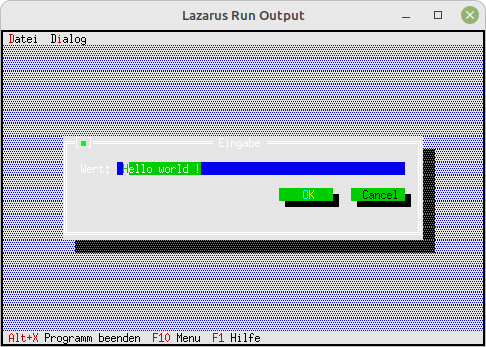

# 15 - Fertige Dialoge
## 15 - String-Eingabe Box
 
  
Es gibt auch einen fertigen Dialog für eine String-Eingabe. 
Es gibt noch <b>InputBoxRect</b>, dort kann man die Grösser der Box selbst festlegen. 
---
 
So sieht der Code für die String-Eingabe aus. 
<pre><code=pascal>  <b>procedure</b> TMyApp.HandleEvent(<b>var</b> Event: TEvent);
  <b>var</b>
    s:ShortString;
  <b>begin</b>
    <b>inherited</b> HandleEvent(Event);
 
    <b>if</b> Event.What = evCommand <b>then</b> <b>begin</b>
      <b>case</b> Event.Command <b>of</b>
        cmInputLine: <b>begin</b>
          s := 'Hello world !';
          <i>// Die InputBox</i>
          <b>if</b> InputBox('Eingabe', 'Wert:', s, 255) = cmOK <b>then</b> <b>begin</b>
            MessageBox('Es wurde "' + s + '" eingegeben', <b>nil</b>, mfOKButton);
          <b>end</b>;
        <b>end</b>;
        <b>else</b> <b>begin</b>
          <b>Exit</b>;
        <b>end</b>;</code></pre>
 
