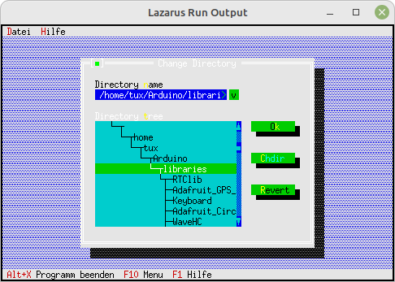

# 15 - Fertige Dialoge
## 25 - Ordner wechseln
<br>
<br><br>
<br>

---
<br>

```pascal
  procedure TMyApp.HandleEvent(var Event: TEvent);
  var
    ChDirDialog: PChDirDialog;
    Ordner: ShortString;
  begin
    inherited HandleEvent(Event);
<br>
    if Event.What = evCommand then begin
      case Event.Command of
        cmChDir: begin
          New(ChDirDialog, Init(fdOpenButton, 1));
          if ExecuteDialog(ChDirDialog, nil) <> cmCancel then begin
            MessageBox('Ordner wurde gewechselt', nil, mfOKButton);
          end;
        end;
        else begin
          Exit;
        end;
```
<br>

