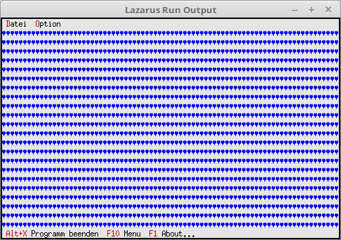

# 19 - Optische-Gestaltung
## 00 --Desktop-Hintergrund Zeichen
<br><br>
Beim Desktophintergrund kann man ein beliebiges Hintergrund-Zeichen zuordnen. Als Default ist das Zeichen <b>#176</b>.<br>
---
Der Hintergrund fügt man ähnlich zu, wie ein Fenster/Dialog, dies geschieht auch mit <b>Insert</b>.<br>
Mit <b>#3</b> füllt es den Hintergrund mit Herzen auf.<br>
```pascal>  constructor TMyApp.Init;
  var
    R: TRect;
  begin
    inherited Init;                                      // Vorfahre aufrufen
    GetExtent(R);
<br>
    DeskTop^.Insert(New(PBackGround, Init(R, #3)));   // Hintergrund einfügen.</font>
  end;```
<br>
