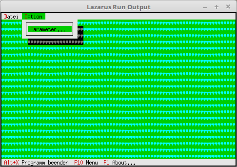

# 19 - Optische-Gestaltung
## 05 --Desktop-Hintergrund Farbe



Wen man die Farbe des Hintergrundes änder will, ist ein wenig komplizierter als nur das Zeichen.
Dazu muss man beim Object **TBackground** die Funktion **GetPalette** überschreiben.


---
Für das Object **TBackground** wird ein Nachkomme erzeugt, welcher eine neue **GetPalette** Funktion bekommt.

```pascal
type
  PMyBackground = ^TMyBackground;
  TMyBackground = object(TBackGround)
    function GetPalette: PPalette; virtual; // neu GetPalette
  end;
```

In der neuen Funktion wird eine andere Palette zugeordnet.

```pascal
  function TMyBackground.GetPalette: PPalette;
  const
    P: string[1] = #74;
  begin
    Result := @P;
  end;
```

Der Konstruktor sieht fast gleich aus wie beim Hintergrundzeichen.
Einziger Unterschied anstelle von **PBackGround** wird **PMyBackground** genommen.

```pascal
  constructor TMyApp.Init;
  var
    R:TRect;
  begin
    inherited Init;                                       // Vorfahre aufrufen
    GetExtent(R);

    DeskTop^.Insert(New(PMyBackground, Init(R, #3)));  // Hintergrund einfügen.
  end;
```


