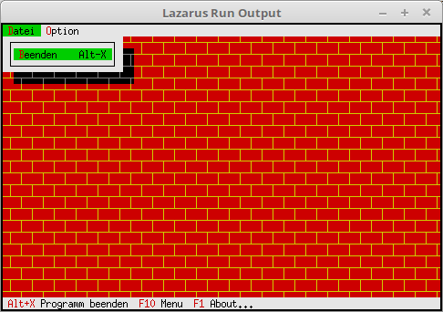

# 19 - Optische-Gestaltung
## 10 --Eigener Desktop Hintergrund
 
  
Man hat sogar die Möglichkeit, den ganzen Background selbst zu zeichnen. 
Da man alles selbst zeichent kann man sich den Umweg über <b>TBackGround</b> sparen und direkt <B>TView</b> vererben. 
<b>TBackGround</b> ist ein direkter Nachkomme von <b>TView</b>. 
---
 
Für das Object <b>TView</b> wird ein Nachkomme erzeugt, welcher eine neue <b>Draw</b> Procedure bekommt. 
<pre><code=pascal><b>type</b>
  PMyBackground = ^TMyBackground;
  TMyBackground = <b>object</b>(TView)
    <b>procedure</b> Draw; <b>virtual</b>; <i>// neu Draw-Procedure.</i>
  <b>end</b>;</code></pre>
In der neuen Funktion wird ein Byte-Muster in Form einer Backsteinwand gezeichnet. 
Die Möglickeiten sind unbegrenzt, man kann ein ganzes Bild erzeugen. 
Das was man ausgeben will, kommt Zeilenweise in den <b>TDrawBuffer</b>. 
Anschliessend wird mit <b>WriteLine(...</b> der Buffer gezeichnet. 
<pre><code=pascal>  <b>procedure</b> TMyBackground.Draw;
  <b>const</b>
    b1 : <b>array</b> [0..3] <b>of</b> Byte = (196, 193, 196, 194); <i>// obere Backsteinreihe.</i>
    b2 : <b>array</b> [0..3] <b>of</b> Byte = (196, 194, 196, 193); <i>// untere Backsteinreihe.</i>
 
  <b>var</b>
    Buf1, Buf2: TDrawBuffer;
    i: integer;
  <b>begin</b>
    <b>for</b> i := 0 <b>to</b> Size.X - 1 <b>do</b> <b>begin</b>
      Buf1[i] := b1[i <b>mod</b> 4] + $46 <b>shl</b> 8;
      Buf2[i] := b2[i <b>mod</b> 4] + $46 <b>shl</b> 8;
    <b>end</b>;
 
    <b>for</b> i := 0 <b>to</b> Size.Y <b>div</b> 2 <b>do</b> <b>begin</b>
      WriteLine(0, i * 2 + 0, Size.X, 1, Buf1);
      WriteLine(0, i * 2 + 1, Size.X, 1, Buf2);
    <b>end</b>;
  <b>end</b>;</code></pre>
Der Konstruktor sieht gleich aus wie bei der Hintergrund-Zeichenfarbe. 
Dem ist Egal ob <b>TMyBackground</b> ein Nachkomme von <b>TView</b> oder <b>TBackground</b> ist. 
<pre><code=pascal>  <b>constructor</b> TMyApp.Init;
  <b>var</b>
    R: TRect;
  <b>begin</b>
    <b>inherited</b> Init;                                <i>// Vorfahre aufrufen</i>
    GetExtent(R);
 
    DeskTop^.Insert(<b>New</b>(PMyBackground, Init(R)));  <i>// Hintergrund einfügen.</i>
  <b>end</b>;</code></pre>
 
