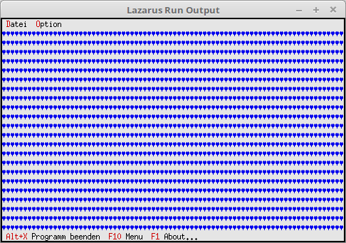

<html>
    <b><h1>19 Optische-Gestaltung</h1></b>
    <b><h2>00-Desktop-Hintergrund Zeichen</h2></b>
  
Beim Desktophintergrund kann man ein beliebiges Hintergrund-Zeichen zuordnen. Als Default ist das Zeichen <b>#176</b>. 

 
Der Hintergrund fügt man ähnlich zu, wie ein Fenster/Dialog, dies geschieht auch mit <b>Insert</b>. 
Mit <b>#3</b> füllt es den Hintergrund mit Herzen auf. 
<pre><code>  <b>constructor</b> TMyApp.Init;
  <b>var</b>
    R: TRect;
  <b>begin</b>
    <b>inherited</b> Init;                                      <i>// Vorfahre aufrufen</i>
    GetExtent(R);
 
    DeskTop^.Insert(<b>New</b>(PBackGround, Init(R, #3)));   <i>// Hintergrund einfügen.</i>
  <b>end</b>;</code></pre>
 
</html>
