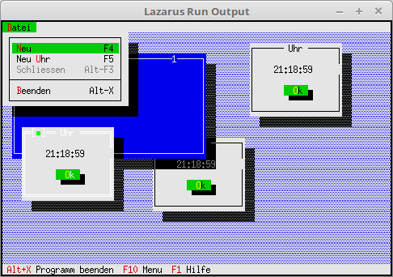

# 20 - Diverses
## 00 - Idle Handle eine Uhr



Hier wird gezeigt, wie man **Idle** verwenden kann.
Diese Leerlaufzeit wird verwendet um eine Uhr in Dialogen zu aktualiesieren.
Das Object mit dem UhrenDialog befindet sich in der Unit **UhrDialog**.

---
Neue Konstante für das Kommado neuer UhrenDialog.

```pascal
const
  cmNewWin = 1001;
  cmNewUhr = 1002;
```

Hier befindet sich die wichtigste Methode **Idle**.
Diese Methode wird aufgerufen, wen die CPU sonst nichts zu tun hat.
Hier wird sie verwendet um die Uhr-Zeit in den Dialogen zu aktualiesieren.

```pascal
type
  TMyApp = object(TApplication)
    zeitalt: Integer;
    constructor Init;

    procedure InitStatusLine; virtual;
    procedure InitMenuBar; virtual;

    procedure HandleEvent(var Event: TEvent); virtual;

    procedure NewWindows;
    procedure NewUhr;

    procedure Idle; Virtual;  // Das wichtigste.
  end;
```

Am Anfang wird ein Fenster und ein Uhrendialog erzeugt.

```pascal
constructor TMyApp.Init;
begin
  inherited Init;   // Der Vorfahre aufrufen.
  NewWindows;       // Fenster erzeugen.
  NewUhr;           // Uhrendialog erzeugen.
end;
```

Neuer Uhrendialog in den Desktop einfügen.

```pascal
procedure TMyApp.NewUhr;
begin
  Desktop^.Insert(ValidView(New(PUhrView, Init)));
end;
```

Der Leeerlaufprozess **Idle**.
Mit **Message(...** werden allen Fenster und Dialgen das **cmUhrRefresh** Kommado übergeben.
Auch wird dazu das Event **evBroadcast** verwendet, das es um eine Übertragung handelt.
Reagieren tut nur der UhrenDialog auf dieses Kommando, weil es dort abgefangen wird.
Beim Fenster läuft dieses einfach durch.
Auch sieht man gut, das das Message nur aufgerufen wird, wen ein Sekunde verstrichen ist.
Als letzter Parameter wird ein Pointer auf einen String übergeben, welcher dir aktuelle Zeit enthält.
Würde man es bei jedem Idle machen, würde die Uhr nur flimmern.

```pascal
procedure TMyApp.Idle;
var
  zeitNeu: Integer;
  s: ShortString;      // Speichert die aktuelle Zeit als String.
begin
  zeitNeu := round(time * 60 * 60 * 24);           // Sekunden berechnen.
  if zeitNeu <> zeitalt then begin                 // Nur aktualliesieren wen ein Sek. vorbei.
    zeitalt := zeitNeu;
    s:= TimeToStr(Now);                            // Aktuelle Zeit als String.
    Message(@Self, evBroadcast, cmUhrRefresh, @s); // Ruft eigener HandleEvent auf.
  end;
end;
```

Dieses HandleEvent interessiert das Kommando **cmUhrRefresh** nicht.

```pascal
procedure TMyApp.HandleEvent(var Event: TEvent);
begin
  inherited HandleEvent(Event);

  if Event.What = evCommand then begin
    case Event.Command of
      cmNewWin: begin
        NewWindows;    // Fenster erzeugen.
      end;
      cmNewUhr: begin
        NewUhr;        // Uhrendialog erzeugen.
      end;
      else begin
        Exit;
      end;
    end;
  end;
  ClearEvent(Event);
end;
```


---
**Unit mit dem Uhren-Dialog.**
<br>
Die Komponenten auf dem Dialog sind nichts besonderes, es hat nur ein OK-Button.
Die Zeit wird direkt mit **WriteLine(...** reingeschrieben.
Aus diesem Grund wurde die Methode **Draw** ergänzt.

```pascal
unit UhrDialog;

```

Die Deklaration des Dialoges.
Hier wird in **ZeitStr** die Zeit gespeichert, so das sie mit **Draw** ausgegeben werden kann.

```pascal
const
  cmUhrRefresh = 1003;

type
  PUhrView = ^TUhrView;
  TUhrView = object(TDialog)
  private
    ZeitStr: ShortString;
  public
    constructor Init;
    procedure Draw; Virtual;
    procedure HandleEvent(var Event: TEvent); virtual;
  end;

```

Im Dioalog wird nur ein OK-Button erzeugt.

```pascal
constructor TUhrView.Init;
var
  R: TRect;
begin
  R.Assign(51, 1, 70, 8);
  inherited Init(R, 'Uhr');

  R.Assign(7, 4, 13, 6);
  Insert(new(PButton, Init(R, '~O~k', cmOK, bfDefault)));
end;

```

In **Draw** sieht man gut, das die Zeit direkt in den Dialog geschrieben wird.

```pascal
procedure TUhrView.Draw;
var
  b: TDrawBuffer;
  c: Byte;
begin
  inherited Draw;
  c := GetColor(7);
  MoveChar(b, ' ', c, Size.X + 4);
  MoveStr(b, ZeitStr, c);
  WriteLine(5, 2, Size.X + 2, 1, b);
end;

```

Das **HandleEvent** ist schon interessanter, dort wird das Event **evBroadcast** und
das Kommando **cmUhrRefresh** abgefangen, welches im Hauptprogramm mit Message übergeben wurde.
Aus **Event.InfoPtr** wird noch der String übernommen welcher die Zeit enthält.
Das Kommando **cmOk** ist nicht besonderes, es schliesst nur den Dialog.

```pascal
procedure TUhrView.HandleEvent(var Event: TEvent);
begin
  inherited HandleEvent(Event);

  case Event.What of
    evBroadcast: begin
      case Event.Command of
        cmUhrRefresh: begin
          ZeitStr := PString(Event.InfoPtr)^;
          Draw;
        end;
      end;
    end;
    evCommand: begin
      case Event.Command of
        cmOK: begin
          Close;
        end;
      end;
    end;
  end;
end;

```


