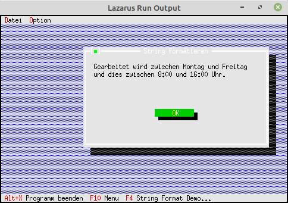

<html>
    <b><h1>20 - Diverses</h1></b>
    <b><h2>05 - String formatieren</h2></b>
  
Mit <b>FormatStr</b> können Strings formatiert werden. 
Dabei sind filgende Formatierungen möglich: 
%c: Char 
%s: String 
%d: Ganzzahlen 
%x: Hexadezimal 
%#: Formatierungen 
Bei Realzahlen muss man sich folgendermassen behelfen: 
<pre><code><b>procedure</b> Str(<b>var</b> X: TNumericType[:NumPlaces[:Decimals]];<b>var</b> S: <b>String</b>);</code></pre>

 

 
<pre><code><b>unit</b> MyDialog;
</code></pre>
Deklaration des Dialogs. 
<pre><code><b>type</b>
  PMyDialog = ^TMyDialog;
  TMyDialog = <b>object</b>(TDialog)
    <b>constructor</b> Init;
  <b>end</b>;
</code></pre>
Bei Integern ist es wichtig, das man diese als <b>PtrInt</b> deklariert. 
<pre><code><b>constructor</b> TMyDialog.Init;
<b>const</b>
  acht = 8;
  vier = 16;
  Mo = 'Montag';
  Fr = 'Freitag';
 
<b>var</b>
  R: TRect;
  Params:<b>record</b>
    s1, s2: PString;
    i1, i2: PtrInt;
  <b>end</b>;
  s: ShortString;
</code></pre>
Hier sieht man, die Formatierung mit <b>FormatStr</b>. 
<pre><code><b>begin</b>
  Params.s1 := NewStr(Mo);
  Params.s2 := NewStr(Fr);
  Params.i1 := acht;
  Params.i2 := vier;
 
  FormatStr(s, 'Gearbeitet wird zwischen %s und %s'#13+
    'und dies zwischen %d:00 und %d:00 Uhr.', (@Params)^);
 
  R.Assign(0, 0, 52, 13);
  R.Move(23, 3);
  <b>inherited</b> Init(R, '<b>String</b> formatieren');
 
  <i>// ---Statictext;</i>
  R.Assign(3, 2, 50, 5);
  Insert(<b>new</b>(PStaticText, Init(R, s)));
 
  <i>// ---Ok-Button</i>
  R.Assign(20, 8, 32, 10);
  Insert(<b>new</b>(PButton, Init(R, '~O~K', cmOK, bfDefault)));
<b>end</b>;
</code></pre>
 
</html>
