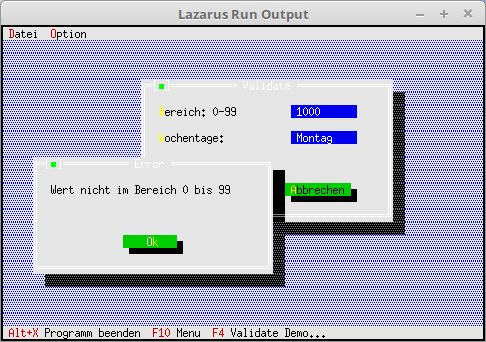

# 20 - Diverses
## 10 - InputLine Validate
 
  
Hier wird eine Bereichsbegrenzung für <b>PInputLine</b> gezeigt. 
Bei der ersten Zeile ist nur eine Zahl zwischen 0 und 99 erlaubt. 
Bei der zweiten Zeile muss es ein Wochentag ( Montag - Freitag ) sein. 
Für den zweiten Fall wäre eine ListBox idealer, mir geht zum zeigen wie es mit der <b>PInputLine</b> geht. 
---
 
---
 
<b>Unit mit dem neuen Dialog.</b> 
  
Ein Dialog mit <b>PInputLine</b> welche eine Prüfung bekommen. 
Wen man <b>Ok</b> drückt, wird ein Validate-Prüfungen ausgeführt. 
Bei <b>Abbruch</b> gibt es keine Prüfung. 
<pre><code><b>unit</b> MyDialog;
</code></pre>
Die Deklaration des Dialoges, hier wird nur das Init überschrieben, welches die Komponenten, für den Dialog erzeugt. 
So nebenbei werden noch die beiden Validate überschrieben. 
Dies wird nur gemacht, das eine deutsche Fehlermeldung bei falscher Eingabe kommt. 
<pre><code><b>type</b>
  PMyDialog = ^TMyDialog;
  TMyDialog = <b>object</b>(TDialog)
    <b>constructor</b> Init;
  <b>end</b>;
 
  PMyRangeValidator = ^TMyRangeValidator;
  TMyRangeValidator = <b>object</b>(TRangeValidator)
    <b>procedure</b> Error; <b>Virtual</b>;   <i>// Überschreibt die englische Fehlermeldung.</i>
  <b>end</b>;
 
  PMyStringLookUpValidator = ^TMyStringLookUpValidator;
  TMyStringLookUpValidator = <b>object</b>(TStringLookUpValidator)
    <b>procedure</b> Error; <b>Virtual</b>;   <i>// Überschreibt die englische Fehlermeldung.</i>
  <b>end</b>;
</code></pre>
Die beiden neuen Fehlermeldungen. 
<pre><code><b>procedure</b> TMyRangeValidator.Error;
<b>var</b>
  Params: <b>array</b>[0..1] <b>Of</b> Longint;
<b>begin</b>
  Params[0] := Min;
  Params[1] := Max;
  MessageBox('Wert nicht im Bereich %d bis %d', @Params, mfError <b>or</b> mfOKButton);
<b>end</b>;
 
<b>procedure</b> TMyStringLookUpValidator.Error;
<b>begin</b>
  MessageBox('Eingabe nicht <b>in</b> g'#129'ltiger Liste', <b>nil</b>, mfError <b>or</b> mfOKButton);
<b>end</b>;
</code></pre>
Hier sieht man, das eine Validate-Prüfung zu den <b>PInputLines</b> dazu kommt. 
<pre><code><b>constructor</b> TMyDialog.Init;
<b>const</b>
  <i>// Wochentage, als String, welche in der PInputLine erlaubt sind.</i>
  WochenTag:<b>array</b>[0..6] <b>of</b> <b>String</b> = ('Montag', 'Dienstag', 'Mittwoch', 'Donnerstag', 'Freitag', 'Samstag', 'Sonntag');
<b>var</b>
  R: TRect;
  i: Integer;
  InputLine: PInputLine;               <i>// Die Eingabe Zeilen.</i>
  StringCollektion: PStringCollection; <i>// Stringliste, welche die erlaubten Strings enthält.</i>
<b>begin</b>
  <i>// Der Dialog selbst.</i>
  R.Assign(0, 0, 42, 11);
  R.Move(23, 3);
  <b>inherited</b> Init(R, 'Validate');
 
  <i>// --- InputLine mit Bereichsbegrenzung 0-99.</i>
  R.Assign(25, 2, 36, 3);
  InputLine := <b>new</b>(PInputLine, Init(R, 6));
  <i>// Validate-Prüfung 0-99.</i>
  InputLine^.SetValidator(<b>new</b>(PMyRangeValidator, Init(0, 99)));
  Insert(InputLine);
  R.Assign(2, 2, 22, 3);
  Insert(<b>New</b>(PLabel, Init(R, '~B~ereich: 0-99', InputLine)));
 
  <i>// --- Wochentage</i>
  <i>// Stringliste erzeugen.</i>
  StringCollektion := <b>new</b>(PStringCollection, Init(10, 2));
  <i>// Stringliste mit den Wochentagen laden.</i>
  <b>for</b> i := 0 <b>to</b> 6 <b>do</b> <b>begin</b>
    StringCollektion^.Insert(NewStr(WochenTag[i]));
  <b>end</b>;
  R.Assign(25, 4, 36, 5);
  InputLine := <b>new</b>(PInputLine, Init(R, 10));
  <i>// Überprüfung mit der Stringliste.</i>
  InputLine^.SetValidator(<b>new</b>(PMyStringLookUpValidator, Init(StringCollektion)));
  Insert(InputLine);
  R.Assign(2, 4, 22, 5);
  Insert(<b>New</b>(PLabel, Init(R, '~W~ochentage:', InputLine)));
 
  <i>// ---Ok-Button</i>
  R.Assign(7, 8, 19, 10);
  Insert(<b>new</b>(PButton, Init(R, '~O~K', cmOK, bfDefault)));
 
  <i>// --- Abbrechen-Button</i>
  R.Assign(24, 8, 36, 10);
  Insert(<b>new</b>(PButton, Init(R, '~A~bbrechen', cmCancel, bfNormal)));
<b>end</b>;
</code></pre>
 
