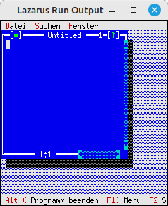

# 20 - Diverses
## 20 - Terminal Resize abfangen (nur Linux)



Es ist auch möglich auf ein Resize-Ereigniss vom terminal zu reagieren.
Dieses Beispiel funktioniert nur mit **Linux**
Technisch bedingt von Free-Vision ist bei **255** Zeichen pro Zeile Schluss.

Achtung !
Dies ist eine Eigenkreation, daher kann es Bugs haben.

---

```pascal
uses
  BaseUnix, // Für Resize Signal und Auflösung
```

Dies muss eingefügt werden, um auf ein Resize-Ereigniss zu reagieren

```pascal

const
  STDIN_FILENO = 0;   // Standard input
  STDOUT_FILENO = 1;  // Standard output
  STDERR_FILENO = 2;  // Standard error output

  TIOCGWINSZ = $5413;
  SIGWINCH = 28;      // Window size change

procedure resize(signal: longint); cdecl;
var
  w: record
  ws_row, ws_col, ws_xpixel, ws_ypixel: cshort;
    end;
  vm: TVideoMode;
begin
  FpIOCtl(STDOUT_FILENO, TIOCGWINSZ, @w);
  if w.ws_col > 255 then begin
    w.ws_col := 255;
  end;

  vm.Col := w.ws_col;
  vm.Row := w.ws_row;
  MyApp.SetScreenVideoMode(vm);

  MyApp.ReDraw;
end;

begin
  MyApp.Init;

  FpSignal(SIGWINCH, @resize); // Resize abfangen

  MyApp.Run;
  MyApp.Done;
end.
```


