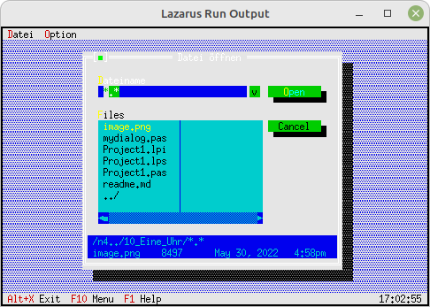

# 30 - Gadgets
## 05 - Eine Uhr
 
  
In diesem Beispiel wird ein kleines Gadgets geladen, welches eine <b>Uhr</b> anzeigt. 

 
    Erzeugt ein kleines Fenster rechts-unten, welches die Uhr anzeigt. 
<pre><code=pascal>    GetExtent(R);
    R.A.X := R.B.X - 9;
    R.A.Y := R.B.Y - 1;
    Heap := New(PClockView, Init(R));
    Insert(Heap); </code></pre>
Den Dialog mit dem Speicher Leak aufrufen. 
<pre><code=pascal>  procedure TMyApp.HandleEvent(var Event: TEvent);
  var
    MyDialog: PMyDialog;
    FileDialog: PFileDialog;
    FileName: ShortString;
  begin
    inherited HandleEvent(Event);
 
    if Event.What = evCommand then begin
      case Event.Command of
        // Dialog mit der ListBox, welcher ein Speicher Leak hat.
        cmDialog: begin
          MyDialog := New(PMyDialog, Init);
          if ValidView(MyDialog) <> nil then begin
            Desktop^.ExecView(MyDialog);   // Dialog ausführen.
            Dispose(MyDialog, Done);       // Dialog und Speicher frei geben.
          end;
        end;
        // Ein FileOpenDialog, bei dem alles in Ordnung ist.
        cmFileTest:begin
          FileName := '*.*';
          New(FileDialog, Init(FileName, 'Datei '#148'ffnen', '~D~ateiname', fdOpenButton, 1));
          if ExecuteDialog(FileDialog, @FileName) <> cmCancel then begin
            NewWindows(FileName); // Neues Fenster mit der ausgewählten Datei.
          end;
        end
        else begin
          Exit;
        end;
      end;
    end;
    ClearEvent(Event);
  end;</code></pre>
Die Idle Routine, welche im Leerlauf den Heap prüft und anzeigt. 
<pre><code=pascal>  procedure TMyApp.Idle;
 
    function IsTileable(P: PView): Boolean;
    begin
      Result := (P^.Options and ofTileable <> 0) and (P^.State and sfVisible <> 0);
    end;
 
  begin
    inherited Idle;
    Heap^.Update;
    if Desktop^.FirstThat(@IsTileable) <> nil then begin
      EnableCommands([cmTile, cmCascade])
    end else begin
      DisableCommands([cmTile, cmCascade]);
    end;
  end;</code></pre>

 
<b>Unit mit dem neuen Dialog.</b> 
  
Der Dialog mit dem dem Speicher Leak 
<pre><code>unit MyDialog;
</code></pre>
Den <b>Destructor</b> deklarieren, welcher das <b>Speicher Leak</b> behebt. 
<pre><code>type
  PMyDialog = ^TMyDialog;
  TMyDialog = object(TDialog)
  const
    cmTag = 1000;  // Lokale Event Konstante
  var
    ListBox: PListBox;
    StringCollection: PStringCollection;
 
    constructor Init;
    destructor Done; virtual;  // Wegen Speicher Leak
    procedure HandleEvent(var Event: TEvent); virtual;
  end;
</code></pre>
Komponenten für den Dialog generieren. 
<pre><code>constructor TMyDialog.Init;
var
  R: TRect;
  ScrollBar: PScrollBar;
  i: Sw_Integer;
const
  Tage: array [0..6] of shortstring = (
    'Montag', 'Dienstag', 'Mittwoch', 'Donnerstag', 'Freitag', 'Samstag', 'Sonntag');
 
begin
  R.Assign(10, 5, 64, 17);
  inherited Init(R, 'ListBox Demo');
 
  // StringCollection
  StringCollection := new(PStringCollection, Init(5, 5));
  for i := 0 to Length(Tage) - 1 do begin
    StringCollection^.Insert(NewStr(Tage[i]));
  end;
 
  // ScrollBar für ListBox
  R.Assign(31, 2, 32, 7);
  ScrollBar := new(PScrollBar, Init(R));
  Insert(ScrollBar);
 
  // ListBox
  R.Assign(5, 2, 31, 7);
  ListBox := new(PListBox, Init(R, 1, ScrollBar));
  ListBox^.NewList(StringCollection);
  Insert(ListBox);
 
  // Tag-Button
  R.Assign(5, 9, 18, 11);
  Insert(new(PButton, Init(R, '~T~ag', cmTag, bfNormal)));
 
  // Cancel-Button
  R.Move(15, 0);
  Insert(new(PButton, Init(R, '~C~ancel', cmCancel, bfNormal)));
 
  // Ok-Button
  R.Move(15, 0);
  Insert(new(PButton, Init(R, '~O~K', cmOK, bfDefault)));
end;
</code></pre>
Manuell den Speicher frei geben. 
Man kann hier versuchsweise das Dispose ausklammern, dann sieht man, 
das man eine Speicherleak bekommt. 
<pre><code>destructor TMyDialog.Done;
begin
   Dispose(ListBox^.List, Done); // Dies Versuchsweise ausklammern
   inherited Done;
end;
</code></pre>
Der EventHandle 
<pre><code>procedure TMyDialog.HandleEvent(var Event: TEvent);
var
  s: ShortString;
begin
  case Event.What of
    evCommand: begin
      case Event.Command of
        cmOK: begin
          // mache etwas
        end;
        cmTag: begin
          str(ListBox^.Focused + 1, s);
          MessageBox('Wochentag: ' + s + ' gew' + #132 + 'hlt', nil, mfOKButton);
          ClearEvent(Event);  // Event beenden.
        end;
      end;
    end;
  end;
  inherited HandleEvent(Event);
end;
</code></pre>
 
