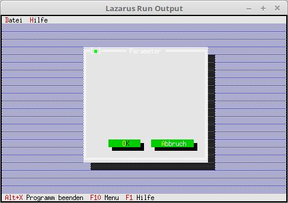

# 90 - Experimente
## 00 - 2 Menus
 
  
Dialog um Buttons ergänzen. 

 
Den Dialog mit Buttons ergänzen. 
Mit <b>Insert</b> fügt man die Komponenten hinzug, in diesem Fall sind es die Buttons. 
Mit bfDefault legt man den Default-Button fest, dieser wird mit <b>[Enter]</b> aktiviert. 
bfNormal ist ein gewöhnlicher Button. 
Der Dialog wird nun Modal geöffnet, somit können <b>keine</b> weiteren Dialoge geöffnet werden. 
dummy hat den Wert, des Button der gedrückt wurde, dies entspricht dem <b>cmxxx</b> Wert. 
Die Höhe der Buttons muss immer <b>2</b> sein, ansonsten gibt es eine fehlerhafte Darstellung. 
<pre><code=pascal>  procedure TMyApp.MyParameter;
  var
    Dia: PDialog;
    R: TRect;
    dummy: word;
  begin
    R.Assign(0, 0, 35, 15);                    // Grösse des Dialogs.
    R.Move(23, 3);                             // Position des Dialogs.
    Dia := New(PDialog, Init(R, 'Parameter')); // Dialog erzeugen.
    with Dia^ do begin
 
      // Ok-Button
      R.Assign(7, 12, 17, 14);
      Insert(new(PButton, Init(R, '~O~K', cmOK, bfDefault)));
 
      // Schliessen-Button
      R.Assign(19, 12, 32, 14);
      Insert(new(PButton, Init(R, '~A~bbruch', cmCancel, bfNormal)));
    end;
    dummy := Desktop^.ExecView(Dia);   // Dialog Modal öffnen.
    Dispose(Dia, Done);                // Dialog und Speicher frei geben.
  end;</code></pre>
 
